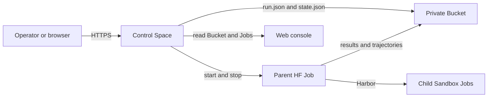

<p align="center">
  
</p>

Harbor-HF is a hosted control service for Harbor benchmark runs on Hugging Face.
It submits runs, starts remote Jobs, keeps Harbor results in a Bucket, and shows
run state and leaderboard results in a web console.

Harbor-HF does not run benchmarks on the operator's computer. One remote parent
Job owns each run. Harbor resolves the benchmark tasks and manages trials,
retries, resume, locks, results, and trajectories.

## How it works

A deployment uses two persistent resources: one private control Space and one
private Bucket.



The Bucket is the durable source of truth. The Space rebuilds a disposable
SQLite view from the Bucket and current HF Job observations. Historical objects
outside `runs/` remain in the Bucket but are not loaded by the current service.

## Web console

The public page shows leaderboard results. Approved Hugging Face users can sign
in to use the run controls. The hosted OAuth session is remembered for 30 days
unless the user logs out, loses authorization, or clears browser cookies.

The submission form has four groups:

1. benchmark preset
2. model ID and provider
3. agent preset and reasoning value
4. cost ceiling and result role

After a model ID is entered, the console queries the Hugging Face Hub and
enables the provider select with only providers that currently report a live
mapping for that model.

The overview form exposes Harbor's native concurrent-trial setting. All-task
presets default to 64 concurrent trials, and the form accepts values from 1 to
128 for the selected run.

A `final` run can enter the leaderboard only when it uses an eligible benchmark
preset and has at least one scored trial. A `diagnostic` run never enters the
leaderboard.

Request failures show the API error code, HTTP status, and safe validation
details, including the invalid field and its constraint. For example, a
provider must use lowercase letters, numbers, and hyphens.

Pause stops the active parent and labeled child Jobs. Resume starts a new parent
against the same Harbor folder, so Harbor skips completed trials. Cancellation
is permanent.

The restored console also includes full run and trial pages, parent Job status,
raw Harbor result inspection, responsive desktop and mobile navigation, and the
Agent Workbench configure, test, and run flow. Workbench compiles one generic
command agent into a normal Harbor run. It does not create profiles, preparation
Jobs, or a second execution system. See
[Agent Workbench](docs/agent-workbench.md).

Run detail URLs use `/runs/<run-id>`, and trial detail URLs use
`/runs/<run-id>/trials/<trial-name>`. Copying either browser URL opens the same
view after the colleague signs in with an approved Hugging Face account.

## Command-line client

Install the Python package with `uv`:

```bash
uv tool install git+https://github.com/huggingface/harbor-hf.git
```

Set the control URL and an approved bearer token in your shell. Do not put the
token in a config file or command argument.

```bash
export HARBOR_HF_CONTROL_URL='https://<control-space-host>'
export HARBOR_HF_CONTROL_BEARER_TOKEN='<service-token>'
```

Inspect runs and parent Jobs:

```bash
harbor-hf run list
harbor-hf run status <run-id>
harbor-hf jobs
harbor-hf presets
```

Submit and control a reviewed preset run:

```bash
harbor-hf run submit \
  --benchmark terminal-bench-2-1 \
  --preset one-task-1-trial \
  --model publisher/model \
  --provider provider \
  --agent pi \
  --agent-version 0.84.4 \
  --cost-ceiling-usd-per-trial 0.25 \
  --role diagnostic \
  --yes
harbor-hf run pause <run-id>
harbor-hf run resume <run-id>
harbor-hf run cancel <run-id> --yes
```

Workbench recipes can be previewed and setup-tested from the CLI. A passed
recipe uses the same `run submit` command with `--harness <recipe.json>` and
`--setup-test <setup-test-id>`. See
[Agent Workbench](docs/agent-workbench.md) for the complete command list.

The CLI can also submit a
direct Harbor `JobConfig` for a diagnostic test:

```bash
harbor-hf submit \
  --config job.yaml \
  --cost-ceiling-usd-per-trial 0.25
```

The service validates the file with the pinned Harbor schema. It sets the owned
paths, labeled HF Sandbox environment, and router credential template. It
rejects credential values, local paths, source jobs, user agents, custom
environments, and configurations with more than one agent.

The reviewed FX preset uses a Harbor-HF adapter that installs a pinned FX
release and translates FX gateway requests through the locked Hugging Face
router. It does not require a Vercel credential.

The cost check runs after each trial because Harbor saves a result before it
calls the end hook. One trial can exceed its limit. When trials run at the same
time, active work can also finish before cancellation completes. A trial with
no reported cost after agent execution keeps its `null` value and reserves the
per-trial ceiling in the aggregate cost check. A failure before agent execution
records zero cost.

The parent stops when a cost limit is crossed and more work can spend money. If
Harbor proves that every configured trial is terminal and retries are disabled,
the parent lets Harbor finish the same job and write `finished_at`. While that
already-live parent finalizes, the reconciler leaves it running. It never starts
a replacement parent for a cost-stopped run. Missing, incomplete, or
retry-enabled state stops the live parent as before. The run still appears as
`cost_stopped`. `finished_at` means execution is complete and does not mean that
the run complied with its cost limit.

## Local development

Requirements:

- Python 3.12 or later
- uv
- Node.js from `.nvmrc`
- npm
- Docker for image checks

Install dependencies:

```bash
uv sync --all-groups --locked
npm ci
uv sync --all-groups --locked --directory packages/harbor-hf-agents
```

The local Space installer supports Linux and macOS. It uses the native
`flock` command on Linux and Python's standard `fcntl` module on macOS, so
macOS does not need a separate `flock` executable.

Start the restored local console and API:

```bash
npm run dev
```

Open `http://127.0.0.1:5173`. Local state stays below the ignored
`.harbor-hf/` directory. Development authentication and filesystem storage are
enabled only for this command. Workbench setup tests use disposable local
Docker containers. Normal hosted writes remain disabled. Use `npm run dev:api`
or `npm run dev:web` when only one process is needed.

Run the local checks:

```bash
uv run ruff check .
uv run ruff format --check .
uv run ty check
uv run pytest --cov=src/harbor_hf --cov-fail-under=85
npm run format:check
npm run lint
npm run typecheck
npm test
npm run build
npm run check:generated
npm run test:e2e
```

See [`docs/CONTROL_SERVICE.md`](docs/CONTROL_SERVICE.md) for deployment settings
and run storage details. The
[interface restoration audit](docs/2026-09-04-interface-restoration-audit.md) records which
historical surfaces were retained, adapted, or removed.

## License

[Apache-2.0](LICENSE)
