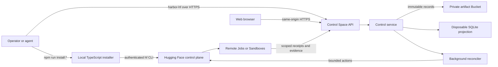

<p align="center">
  
</p>

`harbor-hf` is a Harbor control plane for running benchmark campaigns on Hugging Face infrastructure. It submits pinned work to HF Jobs, tracks retries and Endpoints, preserves evidence in an HF Bucket, and publishes queryable results without running the benchmark on your machine.

A hosted installation uses two persistent resources: one publicly reachable, application-protected control Space and one private Bucket. The Space serves the API and web console while its single control process reconciles immutable records stored in the Bucket.

## Execution model

Harbor-HF has two local command-line layers with different responsibilities:

- `npm run install:*` runs the repository-local TypeScript installer. It invokes
  the authenticated Hugging Face CLI, reads and writes private installer state
  locally, and provisions or verifies the Space and Bucket. It is not a daemon
  and exits after each phase.
- `harbor-hf` is the separately installed Python operator CLI. It is a thin
  HTTPS client for the control API. It does not read the Bucket, call Hugging
  Face infrastructure APIs, run Harbor, load a model, or reconcile campaigns
  locally.

The long-running authority is the single Node.js process in the control Space:



A mutating `harbor-hf` command submits one authenticated and confirmed request.
The control service validates it, writes durable intent, and returns. The local
CLI then exits; preparation, execution, observation, cleanup, and publication
continue asynchronously in the Space. Campaign submission is repeat-safe when
the caller supplies and retains a stable `--idempotency-key`. Campaign action
commands generate and print a new key for each invocation; after an ambiguous
response, inspect campaign and audit state instead of blindly repeating the
action. Use `harbor-hf campaign status`, `harbor-hf jobs`,
`harbor-hf endpoints`, and `harbor-hf results` to observe the resulting
projections.

## Install a hosted control service

This is the high-level installation runbook for an operator or automation
agent. Detailed option syntax is available from:

```bash
npm run install:plan -- --help
npm run install:provision -- --help
npm run install:configure -- --help
npm run install:verify -- --help
npm run install:activate -- --help
npm run install:disable -- --help
```

### Prerequisites and authorization

Before starting:

1. Clone the exact source to install and run `npm ci`.
2. Use Linux with util-linux `flock` available and Node.js `>=22.12.0`.
3. Install Hugging Face CLI `>=1.23.0 <2.0.0`, authenticate it as the approved
   installer identity, and keep that exact CLI version and identity throughout
   plan, provision, and configure.
4. Choose the explicit Space ID `<namespace>/<control-space>`. Never derive it
   from a URL. The default Bucket is
   `<namespace>/<control-space>-artifacts`; pass `--bucket` during planning only
   when a different approved canonical Bucket is required.
5. Obtain explicit authorization before `install:provision`,
   `install:configure`, credential transfer, activation, hardware changes, or
   any other remote mutation. Planning reads remote metadata but does not
   change remote resources.
6. Prepare two distinct, narrowly scoped service credentials for phase two:
   the control credential and the inference-only credential. Do not manually
   put either value in arguments, durable files, logs, plans, receipts, or
   repository content. The installer uses an owner-only temporary handoff file
   for the HF CLI and removes it after the operation.

The installer stores its plan, exact bundle, and receipts in an owner-only
local state directory. Keep that state across phases and recovery attempts.
When using `--state-dir`, pass the same value to every later command. Do not
copy, delete, replace, or quarantine installer state during an active
installation unless a reviewed recovery procedure explicitly requires it.
Installer commands, including non-mutating verification, serialize operations
per target. Before an installer command creates the state root or target lock,
it verifies that the root's physical location is outside the source checkout
and uses that resolved location for the operation. Nonexistent paths beneath
symlinked ancestors that resolve into the checkout are rejected. The nearest
existing state ancestor must be current-user-owned and not shared-writable;
each governing parent must be owned by the current Unix user or UID 0. A
trusted sticky parent protects a current-user-owned child. Processes running
under the same UID remain inside the installer's trust boundary. A valid lock
whose process ended or whose host rebooted is released
automatically by the operating system; a live, wrong-owner, or insecure lock
remains a stop condition.

### 1. Plan

```bash
npm run install:plan -- --space '<namespace>/<control-space>'
```

Plan inspects the local Git revision and release bundle, the authenticated HF
CLI identity, and existing resources in the target namespace. It validates
whether the target is absent, safely resumable, or already installed, then
saves an exact private plan. It does not create or update a remote resource.

Review the reported Space, Bucket, access mode, `cpu-basic` hardware, disabled
write mode, and proposed action before applying. Stop if any target or action
is unexpected.

### 2. Provision resources

```bash
npm run install:provision -- --space '<namespace>/<control-space>'
```

For a new installation, provision creates only:

- the application-protected Docker Space on free `cpu-basic` hardware, stopped
  or paused with writes disabled;
- the private artifact Bucket; and
- an owner-only local bootstrap receipt binding those exact resources.

It does not upload source or request service credential values. Successful
provisioning reports `Provisioning verified`, `Secrets stored: no`, and
`Source uploaded: no`.

### 3. Configure the service

After the exact source and destination of both credential transfers are
approved, run configure from an interactive terminal:

```bash
npm run install:configure -- --space '<namespace>/<control-space>'
```

Phase two:

1. revalidates the saved plan, HF CLI version, installer identity, Space,
   Bucket, variables, hardware, and bootstrap receipt;
2. uploads the exact planned release and records the provider-observed upload
   SHA in the owner-only receipt, or reuses that attestation only when a retry
   observes the same Space SHA;
3. reads both service credential values from the installer-only
   `HARBOR_HF_INSTALL_CONTROL_SECRET` and
   `HARBOR_HF_INSTALL_INFERENCE_SECRET` process variables or, when absent,
   hidden terminal prompts;
4. attests both proposed service credentials' exact fine-grained scopes,
   creates a fresh non-secret object under
   `installer/write-probes/schema=v1/`, and reads back its exact bytes;
5. writes the paired Space secrets without recording their values;
6. sets the complete installed configuration with writes disabled;
7. starts the Space and verifies anonymous health and the exact uploaded
   revision.

Write probes are retained as small capability attestations. Their paths and
contents contain no credential-derived or operator-specific data. A fresh path
is required for every credential acceptance so an existing object can never
let a read-only replacement credential pass. Probe HTTP exchanges use
inactivity deadlines that reset whenever response progress is observed.
Response streams are byte-bounded before Blob materialization.

The control credential must have no global permissions, gated-repository
access, or additional scoped grants. Its only grants are
`repo.content.read` and `repo.write` on the exact artifact Bucket plus
`job.write` and `inference.endpoints.write` on the exact user or organization
namespace. The Job permission also covers Sandbox lifecycle operations. A
broad personal token, a token for another target, and a token with missing or
additional permissions are rejected before either Space secret is written.
Scope attestation reads only the bounded `whoami-v2` response; it never
enumerates durable control records.

The inference credential must likewise have no global permissions,
gated-repository access, or Hub resource grants. Its only permissions are
`inference.endpoints.infer.write` and `inference.serverless.write`. The
installer rejects broad, missing, or additionally scoped inference credentials
before probing the Bucket or persisting either Space secret.

On success it reports `Installation verified`, `Write mode: disabled`, and
`Production ready: no`. A safely interrupted phase can normally be resumed by
rerunning configure with the same private state. Once the receipt contains an
upload SHA, configure stops before mutation if the observed Space source
differs and never overwrites that drift. Do not regenerate the plan, replace
credentials with `--replace-credentials`, or make manual provider changes
merely to bypass a drift or safety error.

### 4. Verify while disabled

```bash
read -rsp 'Control bearer token: ' HARBOR_HF_CONTROL_BEARER_TOKEN
export HARBOR_HF_CONTROL_BEARER_TOKEN
printf '\n'
npm run install:verify -- --space '<namespace>/<control-space>'
```

Verify is non-mutating. It checks the installed resource contract, expected
variables and secret names, runtime health, and disabled write mode.
`HARBOR_HF_CONTROL_BEARER_TOKEN` is the same purpose-scoped operator API bearer
used by the control CLI, not either Space service credential. The installer
uses it to authenticate `/api/v1/system` and verify the runtime's planned
source identity and resource contract; require
`authenticated_system: "passed"` before activation.
Standalone verify reports the provider revision as platform-observed but does
not attest that it equals the original upload SHA. Activation adds that
stronger check against the SHA preserved by configure. Treat any failed check as a
stop condition; do not activate an unverified installation.

Installations completed by an older installer may lack the upload-SHA
attestation required by activation. Rerun `install:configure` once, then verify
again, to upload and attest the exact current plan.

### 5. Activate after operator inspection

Activation uses the same explicit operator bearer used for authenticated
verification. It requires the target-bound saved plan, the saved upload
attestation, an empty campaign projection, and unchanged inspected bindings:

```bash
npm run install:activate -- \
  --space '<namespace>/<control-space>'
```

Activation pauses the Space, writes the complete enabled configuration,
restarts it, and repeats exact source, resource, anonymous-health, and
authenticated-system verification. It does not transfer credentials, run a
benchmark, change hardware, or incur paid cost. On failure it restores disabled
mode and verifies the Space is paused.

Use the separate emergency command to disable writes and pause the Space. This
path does not depend on a healthy control API:

```bash
npm run install:disable -- \
  --space '<namespace>/<control-space>'
```

### Agent stop conditions

An automation agent must stop rather than improvise when:

- remote targets, authenticated identity, HF CLI version, saved plan, source
  revision, manifest, variables, hardware, secret names, or upload SHA drift;
- an existing resource cannot be proven safe to adopt;
- owner-only bootstrap state or its receipt is missing while continuing or
  adopting already-created bootstrap resources;
- either credential scope or exact source-to-destination transfer lacks
  approval;
- authenticated system verification, anonymous health, or rollback
  verification fails;
- a campaign or action request has an ambiguous outcome; inspect durable
  campaign and audit state before deciding whether another request is safe;
- the command requests manual deletion, paid hardware, an unapproved
  activation, or any resource outside the approved Space and Bucket.

If enabled-service health is uncertain, use `install:disable`. It does not
depend on a healthy control API and verifies that the Space ends disabled and
paused.

## Install the operator CLI

The CLI requires Python 3.12 or newer. Install it with [uv](https://docs.astral.sh/uv/):

```bash
uv tool install harbor-hf
```

Create a dedicated [fine-grained Hugging Face User Access Token](https://huggingface.co/docs/hub/security-tokens)
for the CLI, have its identity approved as an operator or reader by the control
service, and point the CLI at your control Space. Harbor-HF uses the token only
to verify its Hugging Face identity through `whoami-v2`; it does not require
repository, inference, Endpoint, Job, billing, or write permissions. Leave
those optional permissions disabled unless the token has a separately approved
purpose.

```bash
export HARBOR_HF_CONTROL_URL=https://<control-space>.hf.space
read -rsp 'Control bearer token: ' HARBOR_HF_CONTROL_BEARER_TOKEN
export HARBOR_HF_CONTROL_BEARER_TOKEN
printf '\n'
harbor-hf status
```

The CLI deliberately does not read the active `hf auth login` credential or
`HF_TOKEN`. Do not substitute a broad `read` or `write` token, print the token,
or store it in the repository. The CLI sends the explicit bearer token only to
the configured HTTPS control API and does not access the Bucket directly. A
valid token does not grant control access unless its Hugging Face identity is
also present in the service access list.

## Start a run

The control console starts a run from Terminal-Bench 2.1, `openai/gpt-oss-20b`, Inference Providers, OpenCode, and no extra reasoning by default. Dashboard harnesses that speak Chat Completions (OpenCode, Qwen Code, mini-swe-agent, Pi, Kimi Code, Hermes, OpenHands, OpenClaw, and DeepSeek Harness) call the locked sandbox inference route. They do not read a Job-level API key. Codex and Claude Code stay off that route because they need a native API the router path cannot preserve. The cost ceiling tracks twice the estimated reservation until you edit it. Submit locks those choices onto a run named `run-<model>-<harness>-<reasoning>-<runtime>-<id>`.

The CLI submits the same lock through promoted profile aliases:

```bash
harbor-hf campaign submit \
  --benchmark <benchmark-profile> \
  --model <model-profile> \
  --harness <harness-profile> \
  --deployment <deployment-profile> \
  --launch-policy <launch-policy-profile> \
  --ceiling-microusd 5000000 \
  --yes
```

`5000000` micro-USD is a $5 campaign ceiling. Use an idempotency key when a caller may repeat the same request:

```bash
harbor-hf campaign submit \
  --benchmark <benchmark-profile> \
  --model <model-profile> \
  --harness <harness-profile> \
  --ceiling-microusd 5000000 \
  --idempotency-key <stable-request-key> \
  --yes
```

Repeating that command with the same actor and key adopts the existing campaign. It does not create a second logical run.

Harbor `harbor_job` fields on a benchmark profile are forwarded into the preparation lock. Diagnostic canary and replacement profiles set `agent_timeout_multiplier` to 4 so the agent gets one hour on the 900-second Terminal-Bench tasks. Official five-trial profiles keep Harbor's published timeouts. A sealed `benchmark_timeout` cannot be retried; submit a new campaign with a new idempotency key.

## Monitor work and results

```bash
harbor-hf campaign list
harbor-hf campaign status <campaign-id>
harbor-hf jobs
harbor-hf endpoints
harbor-hf results
harbor-hf audit
```

The same information is available in the Space's web console. Dotted labels show a hover explanation of that control. Logical task outcomes use full phrases (scored success, provider rejected the request, agent ended without a score) instead of the raw `complete`, `policy`, and `agent` tokens. The Jobs page shows the latest observed state and recorded hardware cost for each HF Job and links the Job ID to its Hub inspect page. Execution Job logs stream Harbor trial stdout as the trial runs. Execution workers preserve a successful exact durable trial result if Harbor exits nonzero only after writing that result; a missing or exceptional trial result remains a failure. The Results list shows pass rate, primary metric, and token cost. Open a result for the Wilson 95% CI, publication identity, and the Hub link to the Bucket prefix that holds the generated objects. Eligible final, clean, fully scored catalogs are also written as a SQLite snapshot under `results/schema=v1/leaderboard/` in the Bucket. Diagnostic and incomplete catalogs stay off that snapshot. Campaign and task pages list the Jobs launched for that campaign. Observed campaign spend is the sum of recorded attempt receipts and Job or Sandbox hardware receipts. The browser uses same-origin API requests and never receives the Bucket credential.

## Repair infrastructure failures

Terminal benchmark outcomes stay sealed. Only a task recorded as an eligible infrastructure failure can receive a bounded replacement:

```bash
harbor-hf campaign retry-infrastructure <campaign-id> \
  --task <task-id> \
  --reason "transient infrastructure failure" \
  --yes
```

Cancellation also preserves existing evidence:

```bash
harbor-hf campaign cancel <run-id> --yes
```

Publication is independent of execution. A publication retry rebuilds deterministic result objects from sealed task receipts and does not rerun model work.

## Safety model

- Campaign locks contain exact profile identities, task IDs, and input digests.
- Worker receipts identify the durable action that authorized the attempt.
- Mutations require an authenticated operator, explicit confirmation, and an idempotency key.
- Browser mutations also require same-origin requests and a CSRF token.
- The Bucket is append-only at the application boundary. A local SQLite database is only a disposable projection rebuilt from Bucket records.
- A terminal logical task cannot run again. Infrastructure repair creates a new physical attempt only for the failed task.
- Endpoint cleanup is complete only after a pause record reports zero ready replicas.
- Result catalogs retain outcome, quality, role, task counts, metric units, and source digests.

The [control service specification](docs/CONTROL_SERVICE.md) defines the durable record protocol, authentication boundary, recovery behavior, and deployment contract.

## Development

Clone the repository and install both locked environments:

```bash
git clone https://github.com/huggingface/harbor-hf.git
cd harbor-hf
uv sync --all-groups
npm ci
```

See [CONTRIBUTING.md](CONTRIBUTING.md) for the local quality gates.

## License

[Apache-2.0](LICENSE)
