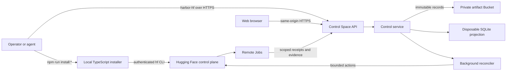

<p align="center">
  
</p>

`harbor-hf` is a Harbor control plane for running benchmark runs on Hugging Face infrastructure. It submits pinned work to HF Jobs, tracks retries and Endpoints, preserves evidence in an HF Bucket, and publishes queryable results without running the benchmark on your machine.

A hosted installation uses two persistent resources: one publicly reachable, application-protected control Space and one private Bucket. The Space serves the API and web console while its single control process reconciles immutable records stored in the Bucket.

## Execution model

Harbor-HF has two local command-line layers with different responsibilities:

- `npm run install:*` runs the repository-local TypeScript installer. It invokes
  the authenticated Hugging Face CLI, reads and writes private installer state
  locally, and provisions or verifies the Space and Bucket. It is not a daemon
  and exits after each phase.
- `harbor-hf` is the separately installed Python operator CLI. It is a thin
  HTTPS client for the control API. It does not read the Bucket, call Hugging
  Face infrastructure APIs, run Harbor, load a model, or reconcile runs
  locally.

The long-running authority is the single Node.js process in the control Space:



A mutating `harbor-hf` command submits one authenticated and confirmed request.
The control service validates it, writes durable intent, and returns. The local
CLI then exits; preparation, execution, observation, cleanup, and publication
continue asynchronously in the Space. Run submission is repeat-safe when
the caller supplies and retains a stable `--idempotency-key`. Run action
commands generate and print a new key for each invocation; after an ambiguous
response, inspect run and audit state instead of blindly repeating the
action. Use `harbor-hf run status`, `harbor-hf jobs`,
`harbor-hf endpoints`, and `harbor-hf results` to observe the resulting
projections.

## Install a hosted control service

This is the high-level installation runbook for an operator or automation
agent. Detailed option syntax is available from:

```bash
npm run install:plan -- --help
npm run install:provision -- --help
npm run install:configure -- --help
npm run install:verify -- --help
npm run install:activate -- --help
npm run install:disable -- --help
```

### Prerequisites and authorization

Before starting:

1. Clone the exact source to install and run `npm ci`.
2. Use Linux with util-linux `flock` available and Node.js `>=22.12.0`.
3. Install Hugging Face CLI `>=1.23.0 <2.0.0`, authenticate it as the approved
   installer identity, and keep that exact CLI version and identity throughout
   plan, provision, and configure.
4. Choose the explicit Space ID `<namespace>/<control-space>`. Never derive it
   from a URL. The default Bucket is
   `<namespace>/<control-space>-artifacts`; pass `--bucket` during planning only
   when a different approved canonical Bucket is required.
5. Obtain explicit authorization before `install:provision`,
   `install:configure`, credential transfer, activation, hardware changes, or
   any other remote mutation. Planning reads remote metadata but does not
   change remote resources.
6. Prepare two distinct, narrowly scoped service credentials for phase two:
   the control credential and the inference-only credential. Do not manually
   put either value in arguments, durable files, logs, plans, receipts, or
   repository content. The installer uses an owner-only temporary handoff file
   for the HF CLI and removes it after the operation.

The installer stores its plan, exact bundle, and receipts in an owner-only
local state directory. Keep that state across phases and recovery attempts.
When using `--state-dir`, pass the same value to every later command. Do not
copy, delete, replace, or quarantine installer state during an active
installation unless a reviewed recovery procedure explicitly requires it.
Installer commands, including non-mutating verification, serialize operations
per target. Before an installer command creates the state root or target lock,
it verifies that the root's physical location is outside the source checkout
and uses that resolved location for the operation. Nonexistent paths beneath
symlinked ancestors that resolve into the checkout are rejected. The nearest
existing state ancestor must be current-user-owned and not shared-writable;
each governing parent must be owned by the current Unix user or UID 0. A
trusted sticky parent protects a current-user-owned child. Processes running
under the same UID remain inside the installer's trust boundary. A valid lock
whose process ended or whose host rebooted is released
automatically by the operating system; a live, wrong-owner, or insecure lock
remains a stop condition.

### 1. Plan

```bash
npm run install:plan -- --space '<namespace>/<control-space>'
```

Plan inspects the local Git revision and release bundle, the authenticated HF
CLI identity, and existing resources in the target namespace. It validates
whether the target is absent, safely resumable, or already installed, then
saves an exact private plan. It does not create or update a remote resource.

Review the reported Space, Bucket, access mode, `cpu-basic` hardware, disabled
write mode, and proposed action before applying. Stop if any target or action
is unexpected.

### 2. Provision resources

```bash
npm run install:provision -- --space '<namespace>/<control-space>'
```

For a new installation, provision creates only:

- the application-protected Docker Space on free `cpu-basic` hardware, stopped
  or paused with writes disabled;
- the private artifact Bucket; and
- an owner-only local bootstrap receipt binding those exact resources.

It does not upload source or request service credential values. Successful
provisioning reports `Provisioning verified`, `Secrets stored: no`, and
`Source uploaded: no`.

### 3. Configure the service

After the exact source and destination of both credential transfers are
approved, run configure from an interactive terminal:

```bash
npm run install:configure -- --space '<namespace>/<control-space>'
```

Phase two:

1. revalidates the saved plan, HF CLI version, installer identity, Space,
   Bucket, variables, hardware, and bootstrap receipt;
2. uploads the exact planned release and records the provider-observed upload
   SHA in the owner-only receipt, or reuses that attestation only when a retry
   observes the same Space SHA;
3. reads both service credential values from the installer-only
   `HARBOR_HF_INSTALL_CONTROL_SECRET` and
   `HARBOR_HF_INSTALL_INFERENCE_SECRET` process variables or, when absent,
   hidden terminal prompts;
4. attests both proposed service credentials' required fine-grained scopes,
   reports additional control-credential grants as prominent warnings, creates
   a fresh non-secret object under
   `installer/write-probes/schema=v1/`, and reads back its exact bytes;
5. writes the paired Space secrets without recording their values;
6. sets the complete installed configuration with writes disabled;
7. starts the Space and reports periodic sanitized runtime-start progress;
8. verifies the exact uploaded revision and anonymous liveness, then polls
   application readiness while the exact `200 {"status":"initializing"}`
   startup response is observed.

Runtime-start progress is reported every 30 seconds while the provider wait is
active. Once the runtime is available, configure polls readiness every 15
seconds and reports initialization progress at most once per minute. Readiness is
bounded to 90 minutes because a full durable projection rebuild can exceed 30
minutes. Any other status or response body fails immediately. A timeout or
unexpected readiness response follows the same fail-closed recovery path that
returns a fresh bootstrap to paused `source_staged`.

Write probes are retained as small capability attestations. Their paths and
contents contain no credential-derived or operator-specific data. A fresh path
is required for every credential acceptance so an existing object can never
let a read-only replacement credential pass. Probe HTTP exchanges use
inactivity deadlines that reset whenever response progress is observed.
Response streams are byte-bounded before Blob materialization.

The control credential must be fine-grained and owned by the exact user or
organization namespace. Its required grants are `repo.content.read` and
`repo.write` on the exact artifact Bucket plus `job.write`,
`inference.endpoints.write` on the exact namespace. Hugging Face's token editor
currently enables `inference.endpoints.infer.write` whenever Endpoint
management is enabled, so the installer accepts that provider-coupled grant
without treating it as overscoping. Harbor-HF never uses the control credential
for inference and never passes it to a worker. The Job permission covers the
physical trial Job lifecycle.

A token for another namespace, a non-fine-grained token, or a token missing a
required permission is rejected before either Space secret is written. Global
permissions, gated-repository access, unrelated resource scopes, and
additional permissions produce a conspicuous `OVER-SCOPED` warning but do not
stop installation after all required capabilities and the fresh Bucket
write/read-back proof pass. Rotate to a narrower credential when the provider
allows one. Scope attestation reads only the bounded `whoami-v2` response; it
never enumerates durable control records.

The inference credential must likewise have no global permissions,
gated-repository access, or Hub resource grants. Its only permissions are
`inference.endpoints.infer.write` and `inference.serverless.write`. The
installer rejects broad, missing, or additionally scoped inference credentials
before probing the Bucket or persisting either Space secret.

On success it reports any control-credential scope warnings first, followed by
`Installation verified`, `Write mode: disabled`, and `Production ready: no`.
A safely interrupted phase can normally be resumed by rerunning configure with
the same private state. Once the receipt contains an upload SHA, configure
stops before mutation if the observed Space source differs and never
overwrites that drift. Do not regenerate the plan, replace credentials with
`--replace-credentials`, or make manual provider changes merely to bypass a
drift or safety error.

### 4. Verify while disabled

```bash
read -rsp 'Control bearer token: ' HARBOR_HF_CONTROL_BEARER_TOKEN
export HARBOR_HF_CONTROL_BEARER_TOKEN
printf '\n'
npm run install:verify -- --space '<namespace>/<control-space>'
```

Verify is non-mutating. It checks the installed resource contract, expected
variables and secret names, runtime health, and disabled write mode.
`HARBOR_HF_CONTROL_BEARER_TOKEN` is the same purpose-scoped operator API bearer
used by the control CLI, not either Space service credential. The installer
uses it to authenticate `/api/v1/system` and verify the runtime's planned
source identity and resource contract; require
`authenticated_system: "passed"` before activation.
Standalone verify reports the provider revision as platform-observed but does
not attest that it equals the original upload SHA. Activation adds that
stronger check against the SHA preserved by configure. Treat any failed check as a
stop condition; do not activate an unverified installation.

Installations completed by an older installer may lack the upload-SHA
attestation required by activation. Rerun `install:configure` once, then verify
again, to upload and attest the exact current plan.

### 5. Activate after operator inspection

Activation uses the same explicit operator bearer used for authenticated
verification. It requires the target-bound saved plan, the saved upload
attestation, an empty run projection, and unchanged inspected bindings:

```bash
npm run install:activate -- \
  --space '<namespace>/<control-space>'
```

Activation pauses the Space, writes the complete enabled configuration,
restarts it, and repeats exact source, resource, anonymous-health, and
authenticated-system verification. It does not transfer credentials, run a
benchmark, change hardware, or incur paid cost. On failure it restores disabled
mode and verifies the Space is paused.

Use the separate emergency command to disable writes and pause the Space. This
path does not depend on a healthy control API:

```bash
npm run install:disable -- \
  --space '<namespace>/<control-space>'
```

### Agent stop conditions

An automation agent must stop rather than improvise when:

- remote targets, authenticated identity, HF CLI version, saved plan, source
  revision, manifest, variables, hardware, secret names, or upload SHA drift;
- an existing resource cannot be proven safe to adopt;
- owner-only bootstrap state or its receipt is missing while continuing or
  adopting already-created bootstrap resources;
- either credential is not fine-grained, lacks a required capability, belongs
  to the wrong namespace, or has an unapproved source-to-destination transfer;
- authenticated system verification, anonymous health, or rollback
  verification fails;
- a run or action request has an ambiguous outcome; inspect durable
  run and audit state before deciding whether another request is safe;
- the command requests manual deletion, paid hardware, an unapproved
  activation, or any resource outside the approved Space and Bucket.

If enabled-service health is uncertain, use `install:disable`. It does not
depend on a healthy control API and verifies that the Space ends disabled and
paused.

## Install the operator CLI

The CLI requires Python 3.12 or newer. Install it with [uv](https://docs.astral.sh/uv/):

```bash
uv tool install harbor-hf
```

Create a dedicated [fine-grained Hugging Face User Access Token](https://huggingface.co/docs/hub/security-tokens)
for the CLI, have its identity approved as an operator or reader by the control
service, and point the CLI at your control Space. Harbor-HF uses the token only
to verify its Hugging Face identity through `whoami-v2`; it does not require
repository, inference, Endpoint, Job, billing, or write permissions. Leave
those optional permissions disabled unless the token has a separately approved
purpose.

```bash
export HARBOR_HF_CONTROL_URL=https://<control-space>.hf.space
read -rsp 'Control bearer token: ' HARBOR_HF_CONTROL_BEARER_TOKEN
export HARBOR_HF_CONTROL_BEARER_TOKEN
printf '\n'
harbor-hf status
```

The CLI deliberately does not read the active `hf auth login` credential or
`HF_TOKEN`. Do not substitute a broad `read` or `write` token, print the token,
or store it in the repository. The CLI sends the explicit bearer token only to
the configured HTTPS control API and does not access the Bucket directly. A
valid token does not grant control access unless its Hugging Face identity is
also present in the service access list.

## Start a run

The control console starts a run from Terminal-Bench 2.1, `openai/gpt-oss-20b`, Inference Providers, OpenCode, and no extra reasoning by default. Dashboard harnesses that speak Chat Completions (OpenCode, Qwen Code, mini-swe-agent, Pi, Kimi Code, Hermes, OpenHands, OpenClaw, FX, and DeepSeek Harness) call the inference bridge inside their physical trial Job. The Job receives only the dedicated inference credential required by its immutable deployment profile. Codex and Claude Code stay off that route because they need a native API the router path cannot preserve. The cost ceiling tracks twice the estimated reservation until you edit it. Submit locks those choices onto a run named `run-<model>-<harness>-<reasoning>-<runtime>-<id>`.

Console tables keep their headers visible while scrolling and provide a text filter under every column. Filters apply to the loaded page; clear them together with **Clear filters**. Run detail loads the complete logical benchmark task list in one request. Task detail shows every attempt's `job.launch` action and projected HF Job status, while marking the one valid selected result. Preparation uses one trusted Job for the Run. Execution launches one physical Job for each logical trial attempt, so an infrastructure replacement adds another Job for the same task.
Launch-policy execution reservations apply to each physical trial Job. Preparation reservations apply to each permitted preparation attempt.

The trusted, digest-pinned deployment Job image is the worker boundary. The
digest-pinned benchmark image remains task data and never supplies the physical
Job bootstrap. Each worker validates the scoped Run and action identity, fetches
only its assigned projection-validated prepared trial, checks its Python-origin
Harbor lock digest and image binding, and executes Harbor once. It rejects
separate verifier images and uploads a canonical evidence manifest for
failures; the controller alone decides whether to launch a replacement Job.
Execution workers pull the locked digest from
`HARBOR_HF_TASK_IMAGE_MIRROR_REPOSITORY`, which defaults to the existing public
trial-worker package. Populate it with the generic mirror workflow before
dispatching tasks. The workflow preserves and verifies each source digest:

```bash
gh workflow run mirror-task-images.yml \
  -f images_json='["docker.io/library/<task-image>@sha256:<digest>"]'
```

Worker control requests retry transient HTTP failures with capped backoff for
the locked Job timeout, so in-flight preparation and evidence writes can
survive a control projection rebuild. Reconciliation dispatches queued Jobs
before scheduled Bucket syncs so remote projection latency does not block work.
It polls active Job states from a short-lived, single-flight namespace cache,
yields while recording each batch, then pushes changes to the web application.
It also yields between bounded Run batches so web requests remain responsive.
Projection rebuilds download control objects directly in parallel, apply them
in bounded SQLite transactions, and verify worker evidence across attempt
batches. Bucket reads retry bounded transient Hub transport and HTTP failures.
Before accepting writes, a rebuilt projection also catches up records created
after its initial Bucket listing.
The validated result catalog is warmed in memory. Publication or supersession
metadata invalidates it immediately; otherwise the service fingerprints Bucket
catalog metadata at the configured sync interval and rebuilds only when that
metadata changes.

The CLI submits the same lock through promoted profile aliases:

```bash
harbor-hf run submit \
  --benchmark <benchmark-profile> \
  --model <model-profile> \
  --harness <harness-profile> \
  --deployment <deployment-profile> \
  --launch-policy <launch-policy-profile> \
  --ceiling-microusd 5000000 \
  --yes
```

`5000000` micro-USD is a $5 run ceiling. Use an idempotency key when a caller may repeat the same request:

```bash
harbor-hf run submit \
  --benchmark <benchmark-profile> \
  --model <model-profile> \
  --harness <harness-profile> \
  --ceiling-microusd 5000000 \
  --idempotency-key <stable-request-key> \
  --yes
```

Repeating that command with the same actor and key adopts the existing run. It does not create a second logical run.

Harbor `harbor_job` fields on a benchmark profile are forwarded into the preparation lock. Diagnostic canary and replacement profiles set `agent_timeout_multiplier` to 4 so the agent gets one hour on the 900-second Terminal-Bench tasks. Official five-trial profiles keep Harbor's published timeouts. A sealed `benchmark_timeout` cannot be retried; submit a new run with a new idempotency key.

## Monitor work and results

```bash
harbor-hf run list
harbor-hf run status <run-id>
harbor-hf jobs
harbor-hf endpoints
harbor-hf results
harbor-hf audit
harbor-hf capacity
```

The shared namespace Job cap limits how many physical Jobs can run at once across runs. It defaults to 16. Update it through the control API without changing a locked run's per-run `max_jobs`. The Overview shows reserved, available, queued, and last-observed Running or Scheduling Jobs, plus usage for each hardware limit. The idempotency key is durable: the same key and payload adopt the first update, while a different payload conflicts.

```bash
curl -X POST "$HARBOR_HF_CONTROL_URL/api/v1/capacity" \
  -H "content-type: application/json" \
  -H "idempotency-key: <stable-request-key>" \
  -d '{"max_active_jobs":128,"confirmed":true}'
```

The same information is available in the Space's web console. Dotted labels show a hover explanation of that control. Hover or focus a Recent run spend point to see its Run ID and exact observed cost. Logical task outcomes use full phrases (scored success, provider rejected the request, agent ended without a score) instead of the raw `complete`, `policy`, and `agent` tokens. The Jobs page shows the latest observed state and recorded hardware cost for each HF Job and links the Job ID to its Hub inspect page. Execution Job logs stream Harbor trial stdout as the trial runs. Execution workers install Harbor from a pinned git commit so new harnesses can be evaluated before a PyPI release. They preserve a successful exact durable trial result if Harbor exits nonzero only after writing that result; a missing or exceptional trial result remains a failure. The Results list shows pass rate, primary metric, and token cost. Open a result for the Wilson 95% CI, publication identity, and the Hub link to the Bucket prefix that holds the generated objects. Eligible final, clean, fully scored catalogs are also written as a SQLite snapshot under `results/schema=v1/leaderboard/` in the Bucket. Diagnostic and incomplete catalogs stay off that snapshot. The Space home page is that public leaderboard: it ranks configurations by score then cost and plots the Pareto frontier of observed spend versus primary metric. One left navigation lists Leaderboard and Admin. Admin contains Overview, Runs, Jobs, Endpoints, Results, Profiles, and Audit. Clicking an Admin view starts Hugging Face login when there is no session; the sidebar has no persistent sign-in or account-details prompt. Login waits for runtime initialization, including the projected operator ACL, so a partial startup cannot misreport an authorized identity as denied. `/health/ready` stays reachable during a long rebuild and reports `initializing` until the complete runtime is ready. Run and task pages list the Jobs launched for that run. Observed run spend is the sum of recorded attempt receipts and Job hardware receipts. The browser uses same-origin API requests and never receives the Bucket credential.

One paused historical Run can receive one immutable current execution attachment when its original prepared Job remains reusable:

```bash
harbor-hf run continue-historical <run-id> \
  --reason "finish unresolved tasks on the reviewed worker" \
  --idempotency-key <stable-request-key> \
  --yes
```

The service verifies the original lock, every prepared trial, launch resources, model, revision, harness, provider, limits, and pricing before attaching the current deployment. Resume then admits only tasks without a selected receipt. Selected infrastructure outcomes are not retryable through this path. The Run ID, original lock, selected outcomes, evidence, spend, and ceiling do not change.

If a defect is found in that attached worker, add one immutable repair attachment:

```bash
harbor-hf run repair-continuation <run-id> \
  --reason "replace the defective continuation worker" \
  --idempotency-key <stable-request-key> \
  --yes
```

The repair may change only the digest-pinned worker image and worker source revision. New Jobs attest both the original continuation and its repair. Existing Jobs remain observable so their reservations and evidence can be settled.

If that repaired worker is defective, add its one allowed immutable successor:

```bash
harbor-hf run repair-continuation-successor <run-id> \
  --reason "replace the defective repaired worker" \
  --idempotency-key <stable-request-key> \
  --yes
```

The successor also changes only the worker image and revision. It binds to both prior attachments, and every later Job attests the complete chain.

## Repair infrastructure failures

Terminal benchmark outcomes stay sealed. Only a task recorded as an eligible infrastructure failure can receive a replacement:

```bash
harbor-hf run retry-infrastructure <run-id> \
  --task <task-id> \
  --reason "transient infrastructure failure" \
  --yes

harbor-hf run retry-infrastructure <run-id> \
  --all-eligible \
  --reason "retry eligible infrastructure failures" \
  --yes
```

The run page has the same control: **Retry infrastructure failures**. It only queues replacement Jobs for eligible infrastructure outcomes, including an infrastructure seal that should not have closed the logical task. Scored misses and other sealed outcomes stay sealed. A retry is a Job on the existing run. The run list does not add a second row. Each replacement receipt names the `job.launch` action that produced it.

If a trial Job ends without a valid result for a replacement-eligible infrastructure reason, the control service records an infrastructure attempt and may launch another Job for that task. A timed-out Harbor process with no result seals `benchmark_timeout` without replacement. Current runs have no policy attempt-count limit. Historical records may still contain `max_infrastructure_attempts`, but current retry admission does not enforce it. Per-Run `max_jobs`, namespace Job capacity, start-rate policy, the finite action-key space, pause and cancellation state, repeated-defect protection, and the cost ceiling still bound new work. A failed reconciliation cycle writes a structured error log and retries on the next cycle instead of stalling silently.

Pausing stops preparation and execution dispatch without discarding terminal Job evidence. A resume task limit selects the first unresolved tasks in locked order and carries that selection through preparation into execution. Resume preserves the failed Job as `prior_attempt`, and bulk infrastructure retry adopts one durable ordered command when the same idempotency key is replayed. A normal resume is not a reviewed worker repair. Repeated matching failures remain paused until a compatible immutable repair attachment is available. Actual receipts remain durable if observed spend crosses the ceiling; the Run becomes budget-exceeded and cannot reserve more work or publish.

Cancellation also preserves existing evidence:

```bash
harbor-hf run cancel <run-id> --yes
```

A cancelling Run stays active until its selected physical Jobs have stopped and its open target tasks are sealed. A failed cancellation or a nonterminal remote observation remains pending and is retried without releasing Job capacity or budget. Task-scoped cancellation leaves unrelated tasks and Jobs running. Cancellation is rejected after publication starts.

Publication is independent of execution. A publication retry rebuilds deterministic result objects from sealed task receipts and does not rerun model work.

## Safety model

- Run locks contain exact profile identities, task IDs, and input digests.
- Worker receipts identify the durable action that authorized the attempt.
- Mutations require an authenticated operator, explicit confirmation, and an idempotency key.
- Browser mutations also require same-origin requests and a CSRF token.
- The Bucket is append-only at the application boundary. The disposable SQLite projection records each object's verified SHA-256 digest and Bucket listing identity, so later syncs detect same-key replacements without downloading unchanged objects.
- A prepared execution Job starts from the reviewed digest-pinned worker image, not the benchmark image. The root worker verifies and unpacks the locked benchmark OCI image, strips privilege-bearing filesystem metadata, and maps the rootfs to one dedicated high host UID/GID.
- The self-contained worker image includes pinned Python, Harbor, and Harbor-HF agent code. `setpriv` gives every task, agent, and shared verifier command real UID/GID 60000, empty supplementary groups, no capabilities, and `no_new_privs`. PRoot supplies only the unpacked filesystem view and fake task-image user identity. It is not the security boundary.
- Preflight requires `git`, `proot`, `setpriv`, `skopeo`, and `umoci`, an unused task UID/GID, no effective `CAP_SYS_PTRACE`, and successful root-file and root-process-environment denial probes. Unsupported isolation is replacement-eligible infrastructure.
- Only the root-owned bridge can read `HF_INFERENCE_TOKEN`. Task processes receive a loopback inference URL, provider-specific credential aliases, and the locked output-token limit. The bridge enforces the locked model, request size, output token, and concurrency limits, then records root-owned provider request and token totals. A harness that completes without positive trusted provider usage is replacement-eligible infrastructure, not a sealed semantic result.
- The worker repeatedly enumerates the dedicated UID, stops every matching process until the set is stable, kills all of them, and verifies none remain. This includes processes that call `setsid` or fork during cleanup. Root-owned direct file copies reject traversal, links, and special files while enforcing total-byte, per-file-byte, entry-count, and path-depth limits.
- OpenHands uses one foreground `tmux` server owned by the task lifecycle, so its tool shell cannot escape PRoot as a daemon.
- An agent timeout quiesces every task process but retains the task rootfs until Harbor freezes `/app`, collects diagnostic logs, and runs the verifier. Normal environment teardown then removes the rootfs.
- A terminal logical task cannot run again. Infrastructure repair creates a new physical attempt only for the failed task.
- Endpoint cleanup is complete only after a pause record reports zero ready replicas.
- Result catalogs retain outcome, quality, role, task counts, metric units, and source digests.

## Reset Run data during cutover

The one-time reset tool deletes only reviewed Run-derived Bucket prefixes and
fails on every unknown path. It preserves benchmark bundles, profiles,
promotions, capacity policy, operator ACLs, and migration records. Normal
control startup does not require this destructive reset: the Run-native
projection ignores retired control trees while their objects remain in the
Bucket. The default reset mode only writes a local, secret-free manifest:

```bash
uv run python scripts/reset_run_data.py \
  --bucket "<namespace>/<artifact-bucket>" \
  --manifest run-data-reset-dry-run.json
```

Review the counts, byte totals, prefix histogram, unknown count,
`delete_key_digest`, and `preserve_identity_digest`. Preserved objects use their
Bucket Xet hash when available; dry-run downloads only preserved configuration
objects that need a SHA-256 fallback. Immediately before applying, confirm that
the control Space reports `write_mode=disabled` and that no HF Job is active.
Then use the delete digest from that fresh manifest:

```bash
uv run python -m json.tool run-data-reset-dry-run.json
```

```bash
uv run python scripts/reset_run_data.py \
  --bucket "<namespace>/<artifact-bucket>" \
  --apply \
  --yes \
  --expected-delete-digest "sha256:<delete-key-digest>" \
  --dry-run-manifest run-data-reset-dry-run.json \
  --verification-manifest run-data-reset-verification.json
```

Apply re-lists the whole Bucket immediately before deletion, deletes in bounded
batches, and re-lists again. Success requires every reviewed delete prefix to
be empty and every preserved key, size, and content identity to remain unchanged.
The final verification manifest stays local.

```bash
uv run python -m json.tool run-data-reset-verification.json
```

For an approved targeted recovery, repeat `--run-id` to inventory and delete
only those Runs' current control and evidence trees. The manifest stores
digests of the selected IDs and prefixes instead of the IDs themselves:

```bash
uv run python scripts/reset_run_data.py \
  --bucket "<namespace>/<artifact-bucket>" \
  --run-id "<failed-run-1>" \
  --run-id "<failed-run-2>" \
  --manifest targeted-run-reset-dry-run.json
```

Apply the reviewed targeted manifest with the same `--run-id` arguments plus
the standard `--apply`, confirmation, digest, and verification options.

## Migrate preserved profiles during Run-native cutover

The one-time profile migration inventories only
`control/schema=v1/profiles/`. It converts legacy capacity limits from
Sandboxes to Jobs and converts legacy deployment Sandbox templates to
digest-pinned trial Job templates. It renames legacy Run-ceiling policy fields
and creates replacement promotions for changed profile identities.
Current-schema profiles and unrelated promotions keep their original bytes. The
tool does not access ACLs, Run data, Space configuration, credentials, or any
other Bucket prefix.

Keep control writes disabled and confirm that no HF Job is active. Create a
fresh local manifest with the reviewed worker image digest and source revision:

```bash
uv run python scripts/migrate_run_native_profiles.py \
  --bucket "<namespace>/<artifact-bucket>" \
  --job-image "<worker-image>@sha256:<digest>" \
  --worker-revision "<full-git-commit>" \
  --manifest run-native-profile-migration-dry-run.json
```

The manifest contains counts, content digests, and a one-way digest binding it
to the destination Bucket. It contains no Bucket ID, profile name, alias, or
record ID. Review its `plan_digest`, then apply that exact plan:

```bash
uv run python scripts/migrate_run_native_profiles.py \
  --bucket "<namespace>/<artifact-bucket>" \
  --job-image "<worker-image>@sha256:<digest>" \
  --worker-revision "<full-git-commit>" \
  --apply \
  --yes \
  --expected-plan-digest "sha256:<plan-digest>" \
  --dry-run-manifest run-native-profile-migration-dry-run.json \
  --verification-manifest run-native-profile-migration-verification.json
```

The installed Bucket API is not transactional. Apply therefore adds and verifies
replacement profile objects, active promotions, and historical promotions in
three separate phases before deleting superseded records. An interrupted partial
batch leaves a resumable state. Rerun the same apply command. Before any write,
the tool verifies every downloaded Xet identity and checks both complete
operation counts against the reviewed limit. Any destination mismatch,
unreviewed content, path collision, concurrent inventory change, or malformed
record aborts the migration.

The [control service specification](docs/CONTROL_SERVICE.md) defines the durable record protocol, authentication boundary, recovery behavior, and deployment contract.

## Development

Clone the repository and install both locked environments:

```bash
git clone https://github.com/huggingface/harbor-hf.git
cd harbor-hf
uv sync --all-groups
npm ci
```

See [CONTRIBUTING.md](CONTRIBUTING.md) for the local quality gates.

## License

[Apache-2.0](LICENSE)
