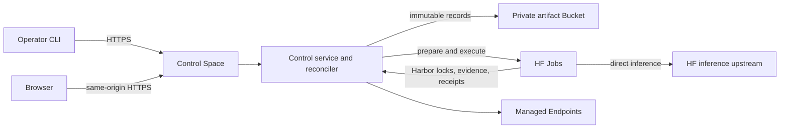

<p align="center">
  
</p>

`harbor-hf` provides a local Workbench loop and a hosted control plane for
running Harbor benchmarks. The local MVP compiles a command-agent harness,
prepares a normal Harbor config, and runs a Terminal-Bench 2.1 canary directly
with the installed Harbor CLI. The hosted path resolves approved profiles,
executes exact trials in HF Jobs, keeps immutable evidence in a private HF
Bucket, and publishes queryable results.

## Run the MVP locally

The local path is deliberately small: configure a harness, test its setup,
select one or both checked-in Terminal-Bench 2.1 canary tasks, inspect the
generated Harbor config, and start Harbor. Inference transport is supplied by
the deployment profile; the Workbench does not expose API protocol, base URL,
or credential controls.

Prerequisites:

1. Node.js `>=22.12.0`, Docker, and Harbor `0.22.0` on `PATH`. Install the
   repository-pinned Harbor revision with:

   ```bash
   uv tool install \
     'harbor @ git+https://github.com/harbor-framework/harbor.git@b37833221e27435a18d7acdd41d875cdc2831893' \
     --force
   ```

2. An inference credential exported as `HF_INFERENCE_TOKEN`.
3. Dependencies installed with `npm ci`.

Start the local API and Vite UI:

```bash
export HF_INFERENCE_TOKEN=<purpose-scoped-inference-token>
npm run dev
```

Workbench setup tests use local Docker by default. To keep the UI and control
API local but execute setup in an HF Job instead, also provide a separate
control credential and your Hugging Face namespace:

```bash
export HARBOR_HF_WORKBENCH_RUNNER=hf-jobs
export HARBOR_HF_NAMESPACE=<hf-user-or-org>
export HF_TOKEN=<jobs-capable-control-token>
export HF_INFERENCE_TOKEN=<separate-inference-token>
npm run dev
```

The setup Job receives the setup command and non-secret setup environment. It
does not receive `HF_INFERENCE_TOKEN` and does not make a model request. The
subsequent **Run locally with Harbor** action still executes Harbor on the local
machine.

Open `http://127.0.0.1:5173/workbench`. The generated secret-free config and
local results are written beneath `.harbor-hf/local-runs/`, which is ignored by
Git. Local execution is enabled only when both `NODE_ENV=development` and
`HARBOR_HF_AUTH_MODE=development`; production and OAuth deployments cannot
invoke a process on the control host.

The checked-in local profile currently uses:

- benchmark `terminal-bench-2-1-canary`;
- model `gpt-oss-20b-together`;
- deployment `tb21-gpt-oss-20b-fast-agent-command-providers`; and
- the Workbench-compiled `CommandAgent` harness.

Use the installed Harbor version shown in the Workbench to spot drift from the
deployment profile before spending on a run.

## Hosted control plane

A hosted installation has two persistent resources:

- one application-protected control Space; and
- one private artifact Bucket.

The Space runs the API, web console, reconciler, and a disposable SQLite
projection. The Bucket is durable truth.



Harbor is the execution authority. It resolves benchmark sources, loads the
selected agent, runs each task environment, invokes the verifier, and writes
the native trial result. Harbor-HF owns profile composition, Run and physical
attempt identity, HF resource lifecycle, admission, retries, evidence
acceptance, cleanup, and publication.

### Direct inference

For an inference-backed execution, the model, harness, and deployment profiles
resolve to one immutable Harbor `AgentConfig`:

- `model_name` is the canonical Harbor model route;
- `env` supplies the approved upstream URL, the Job-provided inference
  credential, and locked runtime settings;
- `extra_allowed_hosts` contains the upstream host; and
- the model and harness must both support the deployment's declared API.

For a direct-inference profile, the Harbor agent calls that upstream directly.
Harbor-HF adds no intermediate transport layer and does not translate between
Chat Completions and Responses. A bounded compatibility launch path remains for
approved immutable profiles whose pinned historical worker requires its
root-owned bridge; the Fast-Agent Workbench profile does not use that path. The
native Harbor result, required session or trajectory, workspace evidence,
verifier output, and infrastructure receipts remain authoritative.

Preparation Jobs receive no inference credential. An execution Job receives
`HF_INFERENCE_TOKEN` only when its resolved deployment has an inference
upstream. Harbor expands the credential reference in `AgentConfig.env` for the
agent that needs it. The control credential never enters a Job.

## Local tools

Harbor-HF has two local command-line surfaces:

- `npm run install:*` operates the repository-local TypeScript installer. It
  plans, provisions, configures, verifies, activates, or disables the hosted
  Space and Bucket through the authenticated Hugging Face CLI.
- `harbor-hf` is the Python operator CLI. It is a thin HTTPS client for the
  control API; it does not read the Bucket, call HF lifecycle APIs, execute
  Harbor, or reconcile Runs locally.

A mutating CLI command submits one confirmed request and exits after durable
intent is recorded. The hosted service continues preparation, execution,
observation, cleanup, and publication asynchronously. Preserve the
`--idempotency-key` used for submission. After an ambiguous response, inspect
Run and audit state rather than submitting again.

## Install the hosted service

### Prerequisites

1. Clone the exact source and run `npm ci`.
2. Use Node.js `>=22.12.0` on Linux with `flock`.
3. Install Hugging Face CLI `>=1.23.0 <2.0.0` and authenticate it as the
   approved installer identity.
4. Select the exact `<namespace>/<control-space>` and private
   `<namespace>/<artifact-bucket>`.
5. Obtain authorization before provisioning, configuring credentials,
   activating writes, changing hardware, or making any other remote mutation.
6. Prepare distinct narrowly scoped credentials for control operations and
   inference.

The installer keeps owner-only plans, release bundles, locks, and receipts
outside the checkout. Reuse the same `--state-dir` throughout an installation.
Do not delete or replace live installer state to bypass a mismatch.

### Plan

```bash
npm run install:plan -- --space '<namespace>/<control-space>'
```

Planning inspects the local revision, release bundle, authenticated CLI
identity, and existing target resources. It does not mutate remote state.
Review the exact Space, Bucket, access mode, hardware, disabled write mode, and
proposed action.

### Provision

```bash
npm run install:provision -- --space '<namespace>/<control-space>'
```

For a new installation this creates only the protected Space and private
Bucket in their safe initial state and records an owner-only resource receipt.
It does not upload source or request credential values.

### Configure

```bash
npm run install:configure -- --space '<namespace>/<control-space>'
```

Configuration revalidates the saved plan and resource receipt, uploads the
exact release, verifies the observed source revision, checks the proposed
credentials' required scopes, stores `HF_TOKEN` and `HF_INFERENCE_TOKEN` as
Space secrets, and leaves writes disabled. Credential values may come from the
installer-only `HARBOR_HF_INSTALL_CONTROL_SECRET` and
`HARBOR_HF_INSTALL_INFERENCE_SECRET` process variables or hidden terminal
prompts. Never place values in arguments, repository files, logs, plans, or
receipts.

### Verify and activate

```bash
npm run install:verify -- --space '<namespace>/<control-space>'
npm run install:activate -- --space '<namespace>/<control-space>' --mode canary
```

Verification is non-mutating and checks source, variables, secret names,
hardware, application protection, health, and write mode. Inspect the service
before activation. Production activation and paid hardware require their own
explicit approval and evidence gates. Use `install:disable` for the supported
emergency write-disable transition.

Detailed installer behavior and stop conditions are in
[the control-service specification](docs/CONTROL_SERVICE.md).

## Install and authenticate the operator CLI

```bash
uv tool install .
export HARBOR_HF_CONTROL_URL=https://<control-space>.hf.space
export HARBOR_HF_CONTROL_BEARER_TOKEN=<approved-control-bearer>
harbor-hf status
```

Use a purpose-scoped bearer approved for this service. Do not substitute a
personal account credential, print the value, or store it in shell history or
repository files. Browser access uses Hugging Face OAuth and same-origin API
requests.

## Agent Workbench

The authenticated [Agent Workbench](docs/agent-workbench.md) compiles generic
command-agent recipes, previews typed environment expansion, and tests setup in
a disposable local Docker container or HF Job. Workbench setup state is
ephemeral. After the exact actor-owned recipe passes setup, it can be combined
with a reviewed benchmark configuration and frozen as a Run-scoped harness in
the ordinary immutable Run lock:

```bash
harbor-hf workbench setup start harness.json --wait --yes
harbor-hf run submit \
  --config tb21-gpt-oss-20b-canary \
  --harness harness.json \
  --setup-test setup-test-... \
  --ceiling-microusd 1000000 \
  --yes
```

The recipe is not published or promoted as a global profile. The reviewed
configuration remains authoritative for the benchmark, model, deployment,
worker image, hardware, launch policy, maximum ceiling, and evidence envelope.

## Start a Run

Inspect the service and promoted profiles:

```bash
harbor-hf status
harbor-hf profiles
harbor-hf capacity
```

Worker control requests retry transient HTTP failures with capped backoff for
the locked Job timeout, so in-flight preparation and evidence writes can
survive a control projection rebuild. Reconciliation dispatches queued Jobs
before scheduled Bucket syncs so remote projection latency does not block work.
It polls active Job states from a short-lived, single-flight namespace cache,
yields while recording each batch, then pushes changes to the web application.
It also yields between bounded Run batches so web requests remain responsive.
Projection rebuilds download control objects directly in parallel, apply them
in bounded SQLite transactions, and verify worker evidence across attempt
batches. Bucket reads retry bounded transient Hub transport and HTTP failures.
Before accepting writes, a rebuilt projection also catches up records created
after its initial Bucket listing.
The validated result catalog is warmed in memory. Publication or supersession
metadata invalidates it immediately; otherwise the service fingerprints Bucket
catalog metadata at the configured sync interval and rebuilds only when that
metadata changes.

The CLI submits the same lock through promoted profile aliases:

```bash
harbor-hf run submit \
  --benchmark <benchmark-profile> \
  --model <model-profile> \
  --harness <harness-profile> \
  --deployment <deployment-profile> \
  --launch-policy <launch-policy-profile> \
  --ceiling-microusd <approved-ceiling> \
  --idempotency-key <stable-request-key> \
  --yes
```

The service resolves aliases once and stores the exact profile records and
execution contract. A credential-free preparation Job uses the pinned Harbor
revision to produce the ordered `JobLock` and one prepared trial record per
logical task. Execution Jobs reconstruct those prepared trials rather than
resolving the benchmark again.

Each physical execution Job:

1. validates its Run, launch action, task assignment, and signed capability;
2. fetches the exact prepared trial and locked task image;
3. runs Harbor with the resolved `AgentConfig`;
4. freezes the post-agent workspace before verification;
5. accepts Harbor's verifier result only when the emitted lock matches the
   prepared lock;
6. uploads content-addressed evidence and a canonical manifest; and
7. submits a terminal receipt to the control API.

## Monitor, cancel, and repair

```bash
harbor-hf run status <run-id>
harbor-hf jobs
harbor-hf endpoints
harbor-hf results
harbor-hf audit
```

Job logs are diagnostic, not authoritative. A valid result needs a selected
attempt receipt, verified evidence digest, and terminal logical outcome in the
Bucket-backed projection.

Cancellation is durable intent. Continue monitoring until active work drains,
owned Endpoints are paused with zero ready replicas, and cleanup evidence is
recorded.

The same information is available in the Space's web console. Dotted labels show a hover explanation of that control. Hover or focus a Recent run spend point to see its Run ID and exact observed cost. Logical task outcomes use full phrases (scored success, provider rejected the request, agent ended without a score) instead of the raw `complete`, `policy`, and `agent` tokens. The Jobs page shows the latest observed state and recorded hardware cost for each HF Job and links the Job ID to its Hub inspect page. Execution Job logs stream Harbor trial stdout as the trial runs. Execution workers install Harbor from a pinned git commit so new harnesses can be evaluated before a PyPI release. They preserve a successful exact durable trial result if Harbor exits nonzero only after writing that result; a missing or exceptional trial result remains a failure. The Results list shows pass rate, primary metric, and token cost. Open a result for the Wilson 95% CI, publication identity, and the Hub link to the Bucket prefix that holds the generated objects. Eligible final, clean, fully scored catalogs are also written as a SQLite snapshot under `results/schema=v1/leaderboard/` in the Bucket. Diagnostic and incomplete catalogs stay off that snapshot. The Space home page is that public leaderboard: it ranks configurations by score then cost and plots the Pareto frontier of observed spend versus primary metric. One left navigation lists Leaderboard and Admin. Admin contains Overview, Runs, Jobs, Endpoints, Results, Profiles, and Audit. Clicking an Admin view starts Hugging Face login when there is no session; the sidebar has no persistent sign-in or account-details prompt. Login waits for runtime initialization, including the projected operator ACL, so a partial startup cannot misreport an authorized identity as denied. `/health/ready` stays reachable during a long rebuild and reports `initializing` until the complete runtime is ready. Run and task pages list the Jobs launched for that run. Observed run spend is the sum of recorded attempt receipts and Job hardware receipts. The browser uses same-origin API requests and never receives the Bucket credential.

One paused historical Run can receive one immutable current execution attachment when its original prepared Job remains reusable:

```bash
harbor-hf run continue-historical <run-id> \
  --reason "finish unresolved tasks on the reviewed worker" \
  --idempotency-key <stable-request-key> \
  --yes
```

The service verifies the original lock, every prepared trial, launch resources, model, revision, harness, provider, limits, and pricing before attaching the current deployment. Resume then admits only tasks without a selected receipt. Selected infrastructure outcomes are not retryable through this path. The Run ID, original lock, selected outcomes, evidence, spend, and ceiling do not change.

If a defect is found in that attached worker, add one immutable repair attachment:

```bash
harbor-hf run repair-continuation <run-id> \
  --reason "replace the defective continuation worker" \
  --idempotency-key <stable-request-key> \
  --yes
```

The repair may change only the digest-pinned worker image and worker source revision. New Jobs attest both the original continuation and its repair. Existing Jobs remain observable so their reservations and evidence can be settled.

If that repaired worker is defective, add its one allowed immutable successor:

```bash
harbor-hf run repair-continuation-successor <run-id> \
  --reason "replace the defective repaired worker" \
  --idempotency-key <stable-request-key> \
  --yes
```

The successor also changes only the worker image and revision. It binds to both prior attachments, and every later Job attests the complete chain.

## Repair infrastructure failures

Terminal benchmark outcomes stay sealed. Only a task recorded as an eligible infrastructure failure can receive a replacement:

```bash
harbor-hf run retry-infrastructure <run-id> \
  --task <task-id> \
  --reason "<infrastructure reason>" \
  --yes
```

Semantic model outcomes, benchmark timeouts, refusals, verifier failures, and
valid zero scores are terminal. Publication recovery never reruns inference.

If a trial Job ends without a valid result for a replacement-eligible infrastructure reason, the control service records an infrastructure attempt and may launch another Job for that task. A timed-out Harbor process with no result seals `benchmark_timeout` without replacement. Current runs have no policy attempt-count limit. Historical records may still contain `max_infrastructure_attempts`, but current retry admission does not enforce it. Per-Run `max_jobs`, namespace Job capacity, start-rate policy, the finite action-key space, pause and cancellation state, repeated-defect protection, and the cost ceiling still bound new work. A failed reconciliation cycle writes a structured error log and retries on the next cycle instead of stalling silently.

Pausing stops preparation and execution dispatch without discarding terminal Job evidence. A resume task limit selects the first unresolved tasks in locked order and carries that selection through preparation into execution. Resume preserves the failed Job as `prior_attempt`, and bulk infrastructure retry adopts one durable ordered command when the same idempotency key is replayed. A normal resume is not a reviewed worker repair. Repeated matching failures remain paused until a compatible immutable repair attachment is available. Actual receipts remain durable if observed spend crosses the ceiling; the Run becomes budget-exceeded and cannot reserve more work or publish.

See:

```bash
harbor-hf run cancel <run-id> --yes
```

A cancelling Run stays active until its selected physical Jobs have stopped and its open target tasks are sealed. A failed cancellation or a nonterminal remote observation remains pending and is retried without releasing Job capacity or budget. Task-scoped cancellation leaves unrelated tasks and Jobs running. Cancellation is rejected after publication starts.

Publication is independent of execution. A publication retry rebuilds deterministic result objects from sealed task receipts and does not rerun model work.

## Safety model

- Run locks contain exact profile identities, task IDs, and input digests.
- Worker receipts identify the durable action that authorized the attempt.
- Mutations require an authenticated operator, explicit confirmation, and an idempotency key.
- Browser mutations also require same-origin requests and a CSRF token.
- The Bucket is append-only at the application boundary. The disposable SQLite projection records each object's verified SHA-256 digest and Bucket listing identity, so later syncs detect same-key replacements without downloading unchanged objects.
- A prepared execution Job starts from the reviewed digest-pinned worker image, not the benchmark image. The root worker verifies and unpacks the locked benchmark OCI image, strips privilege-bearing filesystem metadata, and maps the rootfs to one dedicated high host UID/GID.
- The self-contained worker image includes pinned Python, Harbor, and Harbor-HF agent code. `setpriv` gives every task, agent, and shared verifier command real UID/GID 60000, empty supplementary groups, no capabilities, and `no_new_privs`. PRoot supplies only the unpacked filesystem view and fake task-image user identity. It is not the security boundary.
- Preflight requires `git`, `proot`, `setpriv`, `skopeo`, and `umoci`, an unused task UID/GID, no effective `CAP_SYS_PTRACE`, and successful root-file and root-process-environment denial probes. Unsupported isolation is replacement-eligible infrastructure.
- An inference-backed execution Job receives `HF_INFERENCE_TOKEN` only when required. Direct profiles expose it through the resolved `AgentConfig.env` to the reviewed agent. Explicit bridge-compatibility profiles instead use their pinned root bootstrap, bounded environment, and worker image; arbitrary recipes cannot select that path.
- The worker repeatedly enumerates the dedicated UID, stops every matching process until the set is stable, kills all of them, and verifies none remain. This includes processes that call `setsid` or fork during cleanup. Root-owned direct file copies reject traversal, links, and special files while enforcing total-byte, per-file-byte, entry-count, and path-depth limits.
- OpenHands uses one foreground `tmux` server owned by the task lifecycle, so its tool shell cannot escape PRoot as a daemon.
- An agent timeout quiesces every task process but retains the task rootfs until Harbor freezes `/app`, collects diagnostic logs, and runs the verifier. Normal environment teardown then removes the rootfs.
- A terminal logical task cannot run again. Infrastructure repair creates a new physical attempt only for the failed task.
- Endpoint cleanup is complete only after a pause record reports zero ready replicas.
- Result catalogs retain outcome, quality, role, task counts, metric units, and source digests.

## Reset Run data during cutover

The one-time reset tool deletes only reviewed Run-derived Bucket prefixes and
fails on every unknown path. It preserves benchmark bundles, profiles,
promotions, capacity policy, operator ACLs, and migration records. Normal
control startup does not require this destructive reset: the Run-native
projection ignores retired control trees while their objects remain in the
Bucket. The default reset mode only writes a local, secret-free manifest:

```bash
uv run python scripts/reset_run_data.py \
  --bucket "<namespace>/<artifact-bucket>" \
  --manifest run-data-reset-dry-run.json
```

Review the counts, byte totals, prefix histogram, unknown count,
`delete_key_digest`, and `preserve_identity_digest`. Preserved objects use their
Bucket Xet hash when available; dry-run downloads only preserved configuration
objects that need a SHA-256 fallback. Immediately before applying, confirm that
the control Space reports `write_mode=disabled` and that no HF Job is active.
Then use the delete digest from that fresh manifest:

```bash
uv run python -m json.tool run-data-reset-dry-run.json
```

```bash
uv run python scripts/reset_run_data.py \
  --bucket "<namespace>/<artifact-bucket>" \
  --apply \
  --yes \
  --expected-delete-digest "sha256:<delete-key-digest>" \
  --dry-run-manifest run-data-reset-dry-run.json \
  --verification-manifest run-data-reset-verification.json
```

Apply re-lists the whole Bucket immediately before deletion, deletes in bounded
batches, and re-lists again. Success requires every reviewed delete prefix to
be empty and every preserved key, size, and content identity to remain unchanged.
The final verification manifest stays local.

```bash
uv run python -m json.tool run-data-reset-verification.json
```

For an approved targeted recovery, repeat `--run-id` to inventory and delete
only those Runs' current control and evidence trees. The manifest stores
digests of the selected IDs and prefixes instead of the IDs themselves:

```bash
uv run python scripts/reset_run_data.py \
  --bucket "<namespace>/<artifact-bucket>" \
  --run-id "<failed-run-1>" \
  --run-id "<failed-run-2>" \
  --manifest targeted-run-reset-dry-run.json
```

Apply the reviewed targeted manifest with the same `--run-id` arguments plus
the standard `--apply`, confirmation, digest, and verification options.

## Migrate preserved profiles during Run-native cutover

The one-time profile migration inventories only
`control/schema=v1/profiles/`. It converts legacy capacity limits from
Sandboxes to Jobs and converts legacy deployment Sandbox templates to
digest-pinned trial Job templates. It renames legacy Run-ceiling policy fields
and creates replacement promotions for changed profile identities.
Current-schema profiles and unrelated promotions keep their original bytes. The
tool does not access ACLs, Run data, Space configuration, credentials, or any
other Bucket prefix.

Keep control writes disabled and confirm that no HF Job is active. Create a
fresh local manifest with the reviewed worker image digest and source revision:

```bash
uv run python scripts/migrate_run_native_profiles.py \
  --bucket "<namespace>/<artifact-bucket>" \
  --job-image "<worker-image>@sha256:<digest>" \
  --worker-revision "<full-git-commit>" \
  --manifest run-native-profile-migration-dry-run.json
```

The manifest contains counts, content digests, and a one-way digest binding it
to the destination Bucket. It contains no Bucket ID, profile name, alias, or
record ID. Review its `plan_digest`, then apply that exact plan:

```bash
uv run python scripts/migrate_run_native_profiles.py \
  --bucket "<namespace>/<artifact-bucket>" \
  --job-image "<worker-image>@sha256:<digest>" \
  --worker-revision "<full-git-commit>" \
  --apply \
  --yes \
  --expected-plan-digest "sha256:<plan-digest>" \
  --dry-run-manifest run-native-profile-migration-dry-run.json \
  --verification-manifest run-native-profile-migration-verification.json
```

The installed Bucket API is not transactional. Apply therefore adds and verifies
replacement profile objects, active promotions, and historical promotions in
three separate phases before deleting superseded records. An interrupted partial
batch leaves a resumable state. Rerun the same apply command. Before any write,
the tool verifies every downloaded Xet identity and checks both complete
operation counts against the reviewed limit. Any destination mismatch,
unreviewed content, path collision, concurrent inventory change, or malformed
record aborts the migration.

The [control service specification](docs/CONTROL_SERVICE.md) defines the durable record protocol, authentication boundary, recovery behavior, and deployment contract.

## Development

Use Node.js `>=22.12.0`, the root npm lockfile, strict TypeScript, Biome,
Vitest, and Playwright for the control service and web application. Use Python
3.12+, uv, Ruff, ty, and pytest for the CLI and remote workers. Versioned JSON
Schema is authoritative for durable records; generated TypeScript contracts
must stay synchronized.

Run the checks relevant to the files changed. Do not load or serve models
locally. Authorized local Harbor runs may call their configured remote
inference upstream.
Remote integration tests must be explicitly authorized and must leave every
managed Endpoint paused.

Repository-wide implementation and authorization rules are in
[AGENTS.md](AGENTS.md).

## License

Apache-2.0. See [LICENSE](LICENSE).
