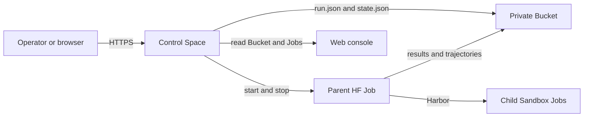

<p align="center">
  
</p>

Harbor-HF is a hosted control service for Harbor benchmark runs on Hugging Face.
It submits runs, starts remote Jobs, keeps Harbor results in a Bucket, and shows
run state and leaderboard results in a web console.

Harbor-HF does not run benchmarks on the operator's computer. One remote parent
Job owns each run. Harbor resolves the benchmark tasks and manages trials,
retries, resume, locks, results, and trajectories.

## How it works

A deployment uses two persistent resources: one private control Space and one
private Bucket.



The Bucket is the durable source of truth. The Space rebuilds a disposable
SQLite view from the Bucket and current HF Job observations. Historical objects
outside `runs/` remain in the Bucket but are not loaded by the current service.

## Web console

The public page shows leaderboard results. Approved Hugging Face users can sign
in to use the run controls.

The submission form has four groups:

1. benchmark preset
2. model ID and provider
3. agent preset and reasoning value
4. cost ceiling and result role

A `final` run can enter the leaderboard only when it uses an eligible benchmark
preset and has at least one scored trial. A `diagnostic` run never enters the
leaderboard.

Pause stops the active parent and labeled child Jobs. Resume starts a new parent
against the same Harbor folder, so Harbor skips completed trials. Cancellation
is permanent.

## Command-line client

Install the Python package with `uv`:

```bash
uv tool install git+https://github.com/huggingface/harbor-hf.git
```

Set the control URL and an approved bearer token in your shell. Do not put the
token in a config file or command argument.

```bash
export HARBOR_HF_CONTROL_URL='https://<control-space-host>'
export HARBOR_HF_CONTROL_BEARER_TOKEN='<service-token>'
```

Inspect runs and parent Jobs:

```bash
harbor-hf run status <run-id>
harbor-hf jobs
harbor-hf presets
```

Control a run:

```bash
harbor-hf run pause <run-id>
harbor-hf run resume <run-id>
harbor-hf run cancel <run-id> --yes
```

The web console is the usual way to submit a preset run. The CLI can submit a
direct Harbor `JobConfig` for a diagnostic test:

```bash
harbor-hf submit \
  --config job.yaml \
  --cost-ceiling-usd-per-trial 0.25
```

The service validates the file with the pinned Harbor schema. It sets the owned
paths, labeled HF Sandbox environment, and router credential template. It
rejects credential values, local paths, source jobs, user agents, custom
environments, and configurations with more than one agent.

The cost check runs after each trial because Harbor saves a result before it
calls the end hook. One trial can exceed its limit. When trials run at the same
time, active work can also finish before cancellation completes.

## Local development

Requirements:

- Python 3.12 or later
- uv
- Node.js from `.nvmrc`
- npm
- Docker for image checks

Install dependencies:

```bash
uv sync --all-groups --locked
npm ci
uv sync --all-groups --locked --directory packages/harbor-hf-agents
```

Run the local checks:

```bash
uv run ruff check .
uv run ruff format --check .
uv run ty check
uv run pytest --cov=src/harbor_hf --cov-fail-under=85
npm run format:check
npm run lint
npm run typecheck
npm test
npm run build
npm run check:generated
npm run test:e2e
```

The local API uses a filesystem Bucket and development authentication when the
matching environment values are set. See
[`docs/CONTROL_SERVICE.md`](docs/CONTROL_SERVICE.md) for deployment settings and
run storage details.

## License

Apache-2.0. See [LICENSE](LICENSE).
