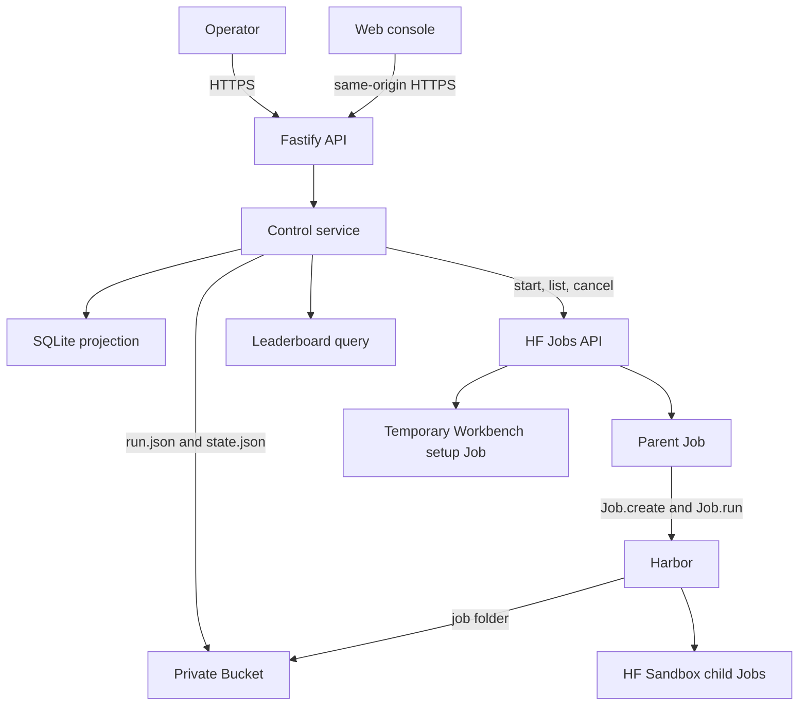

# Architecture

## System boundary

Harbor-HF adds hosted control around Harbor. It does not replace Harbor's run
engine.

Harbor owns:

- `JobConfig` validation and benchmark task resolution
- trial creation, concurrency, retry, and resume
- job and trial locks
- results, rewards, costs, and trajectories
- job finalization and `finished_at`
- built-in agent implementations

Harbor-HF owns:

- authenticated run submission
- reviewed benchmark and agent presets
- the private Bucket and run records
- parent and child HF Job lifecycle
- post-trial cost stops
- the disposable SQLite projection
- the web console, Agent Workbench, and leaderboard

The integration uses Harbor's public `Job.create()`, `Job.run()`,
`Job.on_trial_ended()`, and `len(job)` APIs. It does not contain a second trial
loop or result writer. Each reviewed benchmark preset also selects `cpu-basic`
or `cpu-upgrade` for its temporary task Jobs; presets cannot select accelerator
hardware.

## Components



The control Space and Bucket are the only persistent resources. Parent, child,
and Workbench setup Jobs are temporary. SQLite can be deleted because the
service rebuilds it from Bucket objects and current Job observations.

## Agent Workbench

Agent Workbench compiles a secret-free recipe into one generic Harbor agent
behind `import_path`. A disposable setup test checks installation without a
benchmark, inference credential, Bucket mount, or worker authority. A passed
setup is actor-, digest-, revision-, and time-bound.

The exact tested recipe then enters the ordinary run submission path. The
result has one `run.json`, one `state.json`, one parent Job, and one Harbor job
folder. Workbench does not add profiles, promotions, preparation Jobs, a second
task loop, or another result writer. See [Agent Workbench](agent-workbench.md).

## Run storage

Each run has one immutable record, one mutable desired-state record, and one
Harbor job folder.

```text
runs/<run-id>/
├── run.json
├── state.json
├── attempt-costs/
│   └── <attempt-id>.json
└── job/
    ├── config.json
    ├── lock.json
    ├── result.json
    └── <trial-name>/
        ├── config.json
        ├── lock.json
        ├── result.json
        └── agent/trajectory.json
```

The service creates `run.json` once. An idempotency key produces the run ID.
Repeating the same key and request returns the existing run. Different content
with the same key is an immutable conflict.

The service rewrites `state.json` for `run`, `paused`, and `cancelled` desired
states. The parent writes one immutable cost receipt for each Harbor attempt
below `attempt-costs/`. Harbor alone writes below `job/`.

Historical object layouts remain in the Bucket as an archive. The current
projection reads only `runs/<run-id>/`.

## Presets and direct configuration

Benchmark presets contain a safe Harbor job fragment. They can select datasets,
attempts, trial concurrency, timeout multipliers, retry, and artifacts. They
cannot set paths, agents, credentials, user agents, source jobs, or a custom
environment.

Agent presets select one Harbor agent or import path, a fixed version, allowed
reasoning values, and nonsecret options. A request cannot override the preset
fragment.

A direct `JobConfig` is available for diagnostic work. The API rejects unsafe
and unknown fields and validates the result with a closed form of the JSON
Schema generated from the pinned Harbor revision. Harbor-defined open extension
maps stay open. The service then sets the run paths, labeled HF Sandbox
environment, and inference router variables.

## Parent and child Jobs

The reconciler starts one parent Job per active run. The parent image is selected
by an immutable digest. The Job gets the Bucket mounted at `/data` and reads the
run record from that mount.

The parent receives the two approved service credentials as ephemeral Job
secrets. It uses the control credential to start and label child Sandbox Jobs.
The stored agent configuration contains the fixed `${HF_INFERENCE_TOKEN}`
template. The Sandbox adapter resolves it from the parent's ephemeral secret
only when it builds an agent command environment. Pi receives it as `HF_TOKEN`.
Its adapter combines Pi's public base model metadata with live provider prices,
tool support and context metadata from the public Hugging Face router. The
provider-pinned entry exists only in Pi's temporary configuration, so Pi calls
the requested provider and includes its current prices in each usage record.
The adapter fails before inference if the required metadata is not available.
OpenAI-compatible agents receive the token as `OPENAI_API_KEY` with the fixed
router URL. No credential value is stored in the Bucket or run request.

Harbor's HF Sandbox environment does not yet accept child labels. The small
`LabeledHFSandboxEnvironment` subclass merges `harbor-hf-role=trial` and the run
label and the configured namespace into the same API call that creates the
child. The child cannot become live outside the controller's ownership scope.

## Reconciliation

The reconciler lists owned Jobs and rebuilds the projection before each pass. It
handles runs in creation order and applies the configured parent Job capacity.

For each run it:

1. cancels live parents when the desired state is paused or cancelled;
2. cancels their remaining children on a later reconciliation, after the parent
   is terminal;
3. stops a run when durable trial cost crossed its ceiling, except that it
   leaves an already-live parent running when native zero-retry progress proves
   all trials terminal and Harbor has not written `finished_at` yet;
4. never starts a replacement parent for a cost-stopped run and leaves a
   finished Harbor job unchanged;
5. adopts an existing live parent;
6. cancels live child Jobs that have no live parent; and
7. starts a new parent after the restart delay when capacity is available.

The parent-first stop reduces the child-shutdown race. If Harbor still reports
an in-flight trial as terminal during a controlled stop, the parent preserves
any reported provider cost and removes that interrupted trial result after
Harbor unwinds. A resumed parent uses the same `job/` folder. Harbor reads its
existing result and lock files, then runs only missing trials.

## Projection and status

SQLite has three tables:

- `runs`
- `trials`
- `parent_jobs`

The projection combines `run.json`, `state.json`, attempt cost receipts, Harbor
result files, and Job observations. It deduplicates current results and receipts
by Harbor trial result ID. Desired cancellation and pause have the highest
status priority. A reported per-trial overage or an aggregate exposure overage
comes before normal completion, so an expensive run cannot enter the
leaderboard. This priority still applies when Harbor has written `finished_at`.
A null cost after agent execution stays unknown and reserves the per-trial
ceiling in the aggregate calculation. A failure before agent execution records
zero cost.

The public leaderboard reads finished `final` runs that use an eligible preset
and have at least one numeric reward. Rows group by benchmark preset, agent and
version, model and provider, and reasoning effort. Pass rate is the mean reward.

## Failure behavior

The service rejects unknown request fields, unknown presets, unsupported
reasoning values, non-positive cost limits, unsafe direct configuration, and
credential literals.

Cost enforcement occurs after a trial result is written. The parent preserves
an immutable receipt before Harbor can remove a failed retry folder. It reloads
all receipts after restart and applies the same cost check before `Job.run()`.
One trial can cross its limit, and concurrent work can finish before
cancellation. A null cost after agent execution reserves the full per-trial
ceiling without claiming that amount was observed. A failure before agent
execution records zero cost.

When reported cost or total observed and reserved exposure crosses a limit, the
parent reads Harbor's current `JobResult`. It raises immediately if work can
still spend money or if the result does not prove completion. The proof requires
a matching native total, completed equal to total, zero running and pending
trials, and zero configured retries. Missing, malformed, inconsistent, or
retry-enabled state fails closed.

When the strict check proves that all work is terminal, the parent does not
raise. The same Harbor `Job.run()` call writes `finished_at`. During this short
interval, the reconciler leaves the already-live parent running when the native
counters show completed equal to total, zero running and pending trials, and
zero retries. It does not start a replacement for a cost-stopped run. Any
uncertain state, or a pause or cancellation, still stops the parent.

Harbor-HF does not count trial folders or store its own completion state. The
projection still reports the run as `cost_stopped`, because `finished_at`
records execution completion rather than cost compliance.

A failed parent can restart after the fixed delay. A cancelled run cannot
resume. A projection rebuild failure, immutable run conflict, unlabeled child,
or Job cancellation failure requires operator review rather than a second
control path.

## Planned launch configuration

The [configurable launch plan](2026-09-08-configurable-launch-plan.md) describes
one native configuration editor for multiple sources, built-in and custom agents,
and HF launch restrictions. It is planned work; the current submission behavior
above remains unchanged.
