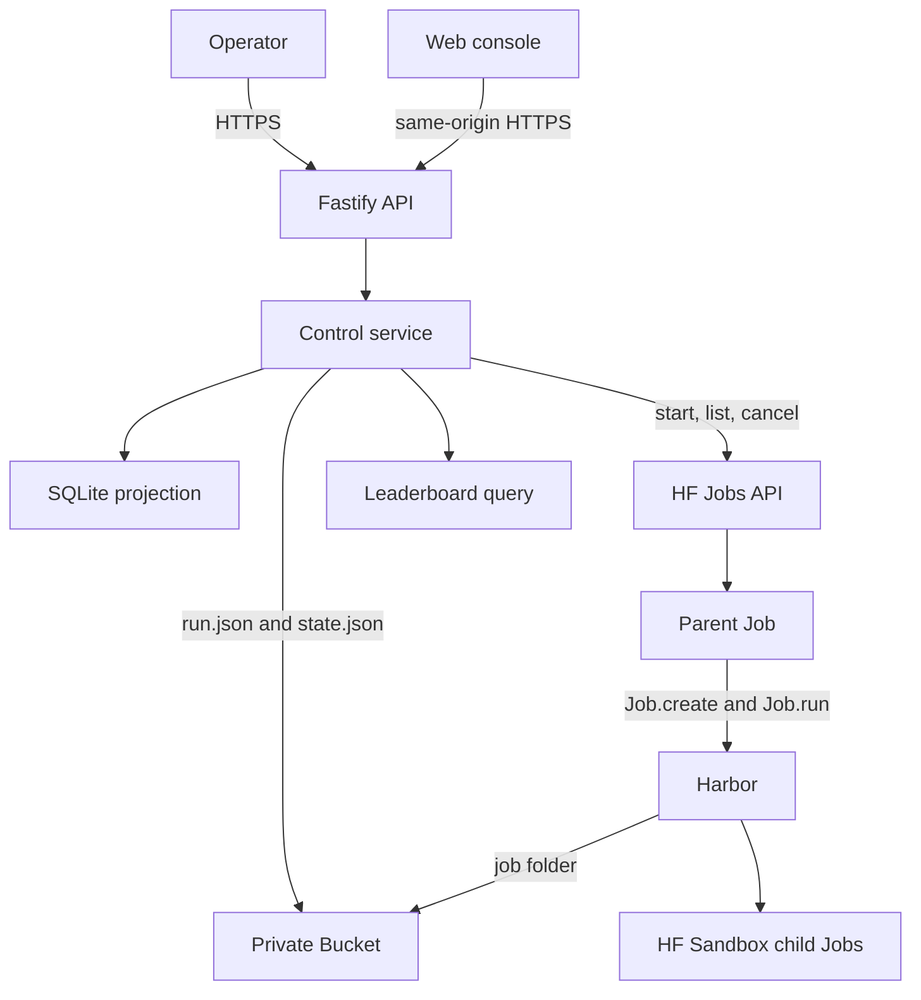

# Architecture

## System boundary

Harbor-HF adds hosted control around Harbor. It does not replace Harbor's run
engine.

Harbor owns:

- `JobConfig` validation and benchmark task resolution
- trial creation, concurrency, retry, and resume
- job and trial locks
- results, rewards, costs, and trajectories
- built-in agent implementations

Harbor-HF owns:

- authenticated run submission
- reviewed benchmark and agent presets
- the private Bucket and run records
- parent and child HF Job lifecycle
- post-trial cost stops
- the disposable SQLite projection
- the web console and leaderboard

The integration uses Harbor's public `Job.create()`, `Job.run()`,
`Job.on_trial_ended()`, and `len(job)` APIs. It does not contain a second trial
loop or result writer.

## Components



The control Space and Bucket are the only persistent resources. Parent and child
Jobs are temporary. SQLite can be deleted because the service rebuilds it from
Bucket objects and current Job observations.

## Run storage

Each run has one immutable record, one mutable desired-state record, and one
Harbor job folder.

```text
runs/<run-id>/
├── run.json
├── state.json
└── job/
    ├── config.json
    ├── lock.json
    ├── result.json
    └── <trial-name>/
        ├── config.json
        ├── lock.json
        ├── result.json
        └── agent/trajectory.json
```

The service creates `run.json` once. An idempotency key produces the run ID.
Repeating the same key and request returns the existing run. Different content
with the same key is an immutable conflict.

The service rewrites `state.json` for `run`, `paused`, and `cancelled` desired
states. Harbor alone writes below `job/`.

Historical object layouts remain in the Bucket as an archive. The current
projection reads only `runs/<run-id>/`.

## Presets and direct configuration

Benchmark presets contain a safe Harbor job fragment. They can select datasets,
attempts, trial concurrency, timeout multipliers, retry, and artifacts. They
cannot set paths, agents, credentials, user agents, source jobs, or a custom
environment.

Agent presets select one Harbor agent or import path, a fixed version, allowed
reasoning values, and nonsecret options. A request cannot override the preset
fragment.

A direct `JobConfig` is available for diagnostic work. The API rejects unsafe
fields and validates the result with the JSON Schema generated from the pinned
Harbor revision. It then sets the run paths, labeled HF Sandbox environment,
and inference router variables.

## Parent and child Jobs

The reconciler starts one parent Job per active run. The parent image is selected
by an immutable digest. The Job gets the Bucket mounted at `/data` and reads the
run record from that mount.

The parent receives the two approved service credentials as ephemeral Job
secrets. It uses the control credential to start and label child Sandbox Jobs.
The selected agent receives the inference credential through the fixed
`${HF_INFERENCE_TOKEN}` environment template. No credential value is stored in
the Bucket or run request.

Harbor's HF Sandbox environment does not yet accept child labels. The small
`LabeledHFSandboxEnvironment` subclass merges `harbor-hf-role=trial` and the run
label into the same API call that creates the child. The child cannot become
live without its ownership labels.

## Reconciliation

The reconciler lists owned Jobs and rebuilds the projection before each pass. It
handles runs in creation order and applies the configured parent Job capacity.

For each run it:

1. cancels live labeled Jobs when the desired state is paused or cancelled;
2. stops a run when durable trial cost crossed its ceiling;
3. leaves a finished Harbor job unchanged;
4. adopts an existing live parent;
5. cancels live child Jobs that have no live parent; and
6. starts a new parent after the restart delay when capacity is available.

A resumed parent uses the same `job/` folder. Harbor reads its existing result
and lock files, then runs only missing trials.

## Projection and status

SQLite has three tables:

- `runs`
- `trials`
- `parent_jobs`

The projection combines `run.json`, `state.json`, Harbor result files, and Job
observations. Desired cancellation and pause have the highest status priority.
A cost stop comes before normal completion so an expensive completed trial
cannot enter the leaderboard.

The public leaderboard reads finished `final` runs that use an eligible preset
and have at least one numeric reward. Rows group by benchmark preset, agent and
version, model and provider, and reasoning effort. Pass rate is the mean reward.

## Failure behavior

The service rejects unknown request fields, unknown presets, unsupported
reasoning values, non-positive cost limits, unsafe direct configuration, and
credential literals.

Cost enforcement occurs after a trial result is written. One trial can cross its
limit, and concurrent work can finish before cancellation. The durable result
keeps that evidence.

A failed parent can restart after the fixed delay. A cancelled run cannot
resume. A projection rebuild failure, immutable run conflict, unlabeled child,
or Job cancellation failure requires operator review rather than a second
control path.
