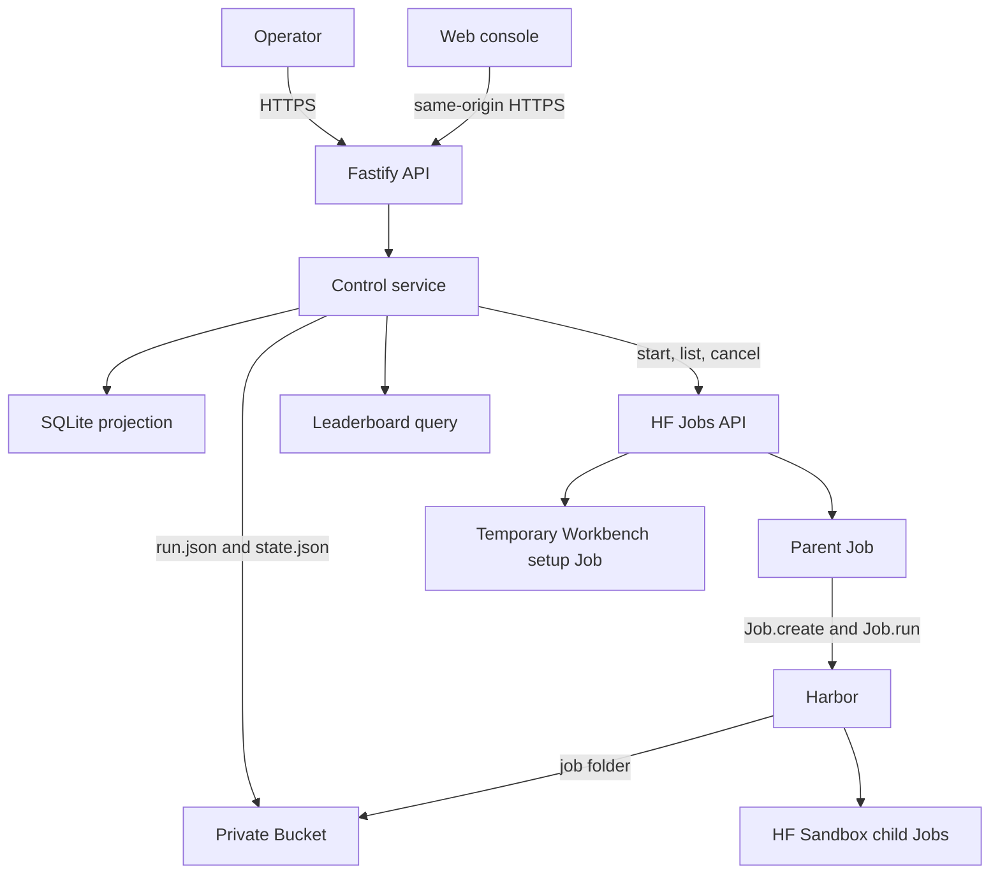

> **Execution-disabled integration (2026-09-04):** This greenfield branch is not
> production-ready. Run submission, actions, remote setup tests, and automatic
> reconciliation are disabled before admission or credential resolution, even
> when configuration writes are enabled. Workbench saves native Harbor JobConfig
> fragments; New Run previews configuration without task resolution or a Job.
> HF_TOKEN stays exclusively in the control Space. Neither persistent secret is
> forwarded. Parent-worker execution and private Hub/Harbor patches are removed.
> Execution descriptions below are deferred design, not available behavior or
> permission to launch. See [execution boundary](../docs/execution-disabled-integration.md).

# Architecture

## System boundary

Harbor-HF adds hosted control around Harbor. It does not replace Harbor's run
engine.

Harbor owns:

- `JobConfig` validation and benchmark task resolution
- trial creation, concurrency, retry, and resume
- job and trial locks
- results, rewards, costs, and trajectories
- built-in agent implementations

Harbor-HF owns:

- authenticated run submission
- reviewed benchmark and agent presets
- the private Bucket and run records
- parent and child HF Job lifecycle
- post-trial cost stops
- the disposable SQLite projection
- the web console, Agent Workbench, and leaderboard

The integration uses Harbor's public `Job.create()`, `Job.run()`,
`Job.on_trial_ended()`, and `len(job)` APIs. It does not contain a second trial
loop or result writer. Each reviewed benchmark preset also selects `cpu-basic`
or `cpu-upgrade` for its temporary task Jobs; presets cannot select accelerator
hardware.

## Components



The control Space and Bucket are the only persistent resources. Parent, child,
and Workbench setup Jobs are temporary. SQLite can be deleted because the
service rebuilds it from Bucket objects and current Job observations.

## Agent Workbench

Agent Workbench compiles a secret-free recipe into one generic Harbor agent
behind `import_path`. A disposable setup test checks installation without a
benchmark, inference credential, Bucket mount, or worker authority. A passed
setup is actor-, digest-, revision-, and time-bound.

The exact tested recipe then enters the ordinary run submission path. The
result has one `run.json`, one `state.json`, one parent Job, and one Harbor job
folder. Workbench does not add profiles, promotions, preparation Jobs, a second
task loop, or another result writer. See [Agent Workbench](agent-workbench.md).

## Run storage

Each run has one immutable record, one mutable desired-state record, and one
Harbor job folder.

```text
runs/<run-id>/
├── run.json
├── state.json
├── attempt-costs/
│   └── <attempt-id>.json
└── job/
    ├── config.json
    ├── lock.json
    ├── result.json
    └── <trial-name>/
        ├── config.json
        ├── lock.json
        ├── result.json
        └── agent/trajectory.json
```

The service creates `run.json` once. An idempotency key produces the run ID.
Repeating the same key and request returns the existing run. Different content
with the same key is an immutable conflict.

The service rewrites `state.json` for `run`, `paused`, and `cancelled` desired
states. The parent writes one immutable cost receipt for each Harbor attempt
below `attempt-costs/`. Harbor alone writes below `job/`.

Historical object layouts remain in the Bucket as an archive. The current
projection reads only `runs/<run-id>/`.

## Presets and direct configuration

Benchmark presets contain a safe Harbor job fragment. They can select datasets,
attempts, trial concurrency, timeout multipliers, retry, and artifacts. They
cannot set paths, agents, credentials, user agents, source jobs, or a custom
environment.

Agent presets select one Harbor agent or import path, a fixed version, allowed
reasoning values, and nonsecret options. A request cannot override the preset
fragment.

A direct `JobConfig` is available for diagnostic work. The API rejects unsafe
and unknown fields and validates the result with a closed form of the JSON
Schema generated from the pinned Harbor revision. Harbor-defined open extension
maps stay open. The service then sets the run paths, labeled HF Sandbox
environment, and inference router variables.

## Execution boundary

Parent and child execution is disabled. No parent receives a writable Bucket
mount or persistent control credential. HF_TOKEN remains in the control Space;
the inference secret is retained but unforwarded. The removed private Sandbox
adapter is not a supported integration. Future execution must use a reviewed
public Harbor CLI boundary without implementing Harbor-owned state or retries.

## Reconciliation

The reconciler lists owned Jobs and rebuilds the projection before each pass. It
handles runs in creation order and applies the configured parent Job capacity.

For each run it:

1. cancels live parents when the desired state is paused or cancelled;
2. cancels their remaining children on a later reconciliation, after the parent
   is terminal;
3. stops a run when durable trial cost crossed its ceiling;
4. leaves a finished Harbor job unchanged;
5. adopts an existing live parent;
6. cancels live child Jobs that have no live parent; and
7. starts a new parent after the restart delay when capacity is available.

The parent-first stop reduces the child-shutdown race. If Harbor still reports
an in-flight trial as terminal during a controlled stop, the parent preserves
any reported provider cost and removes that interrupted trial result after
Harbor unwinds. A resumed parent uses the same `job/` folder. Harbor reads its
existing result and lock files, then runs only missing trials.

## Projection and status

SQLite has three tables:

- `runs`
- `trials`
- `parent_jobs`

The projection combines `run.json`, `state.json`, attempt cost receipts, Harbor
result files, and Job observations. It deduplicates current results and receipts
by Harbor trial result ID. Desired cancellation and pause have the highest
status priority. A missing cost or cost stop comes before normal completion, so
an unaccounted or expensive attempt cannot enter the leaderboard.

The public leaderboard reads finished `final` runs that use an eligible preset
and have at least one numeric reward. Rows group by benchmark preset, agent and
version, model and provider, and reasoning effort. Pass rate is the mean reward.

## Failure behavior

The service rejects unknown request fields, unknown presets, unsupported
reasoning values, non-positive cost limits, unsafe direct configuration, and
credential literals.

Cost enforcement occurs after a trial result is written. The parent preserves
an immutable receipt before Harbor can remove a failed retry folder. It reloads
all receipts after restart. One trial can cross its limit, and concurrent work
can finish before cancellation. A missing cost stops the run.

A failed parent can restart after the fixed delay. A cancelled run cannot
resume. A projection rebuild failure, immutable run conflict, unlabeled child,
or Job cancellation failure requires operator review rather than a second
control path.
