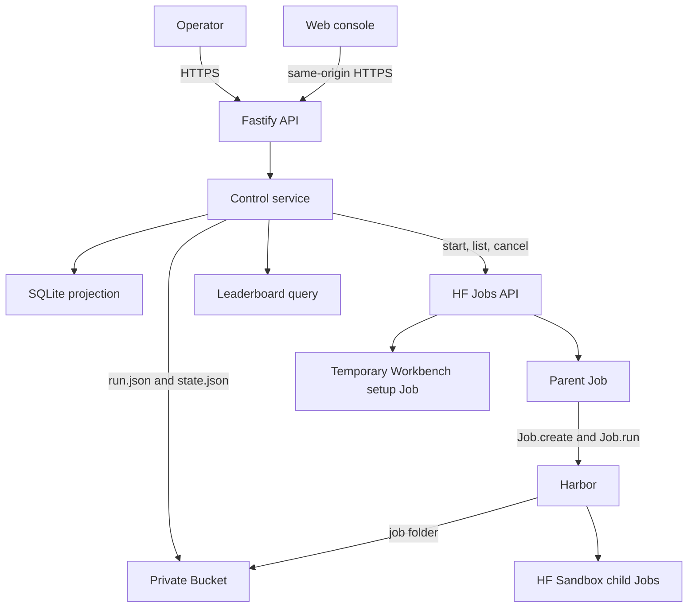

# Architecture

## System boundary

Harbor-HF adds hosted control around Harbor. It does not replace Harbor's run
engine.

Harbor owns:

- `JobConfig` validation and benchmark task resolution
- trial creation, concurrency, retry, and resume
- job and trial locks
- results, rewards, costs, and trajectories
- job finalization and `finished_at`
- built-in agent implementations

Harbor-HF owns:

- authenticated run submission
- reviewed benchmark and agent presets
- the private Bucket and run records
- parent and child HF Job lifecycle
- post-trial cost stops
- the disposable SQLite projection
- the web console, Agent Workbench, and leaderboard

The integration uses Harbor's public `Job.create()`, `Job.run()`,
`Job.on_trial_ended()`, and `len(job)` APIs. It does not contain a second trial
loop or result writer. Each reviewed benchmark preset also selects `cpu-basic`
or `cpu-upgrade` for its temporary task Jobs; presets cannot select accelerator
hardware.

## Components



The control Space and Bucket are the only persistent resources. Parent, child,
and Workbench setup Jobs are temporary. SQLite can be deleted because the
service rebuilds it from Bucket objects and current Job observations.

## Agent Workbench

Agent Workbench compiles a secret-free recipe into one generic Harbor agent
behind `import_path`. A disposable setup test checks installation without a
benchmark, inference credential, Bucket mount, or worker authority. A passed
setup is actor-, digest-, revision-, and time-bound.

The exact tested recipe then enters the ordinary run submission path. The
result has one `run.json`, one `state.json`, one parent Job, and one Harbor job
folder. Workbench does not add profiles, promotions, preparation Jobs, a second
task loop, or another result writer. See [Agent Workbench](agent-workbench.md).

## Run storage

Each run has one immutable record, one mutable desired-state record, optional
shared presentation metadata, and one Harbor job folder.

```text
runs/<run-id>/
├── run.json
├── presentation.json  # optional shared Runs visibility
├── pricing-corrections.json  # optional audited shared estimate rates
├── state.json
├── attempt-costs/
│   └── <attempt-id>.json
└── job/
    ├── config.json
    ├── lock.json
    ├── result.json
    └── <trial-name>/
        ├── config.json
        ├── lock.json
        ├── result.json
        └── agent/trajectory.json
```

The service creates `run.json` once. An idempotency key produces the run ID.
Repeating the same key and request returns the existing run. Different content
with the same key is an immutable conflict.

The service rewrites `state.json` for `run`, `paused`, and `cancelled` desired
states. The parent writes one immutable cost receipt for each Harbor attempt
below `attempt-costs/`. Harbor alone writes below `job/`.

Historical object layouts remain in the Bucket as an archive. The current
projection reads only `runs/<run-id>/`.

Shared archive visibility is separate from execution state. The optional
`presentation.json` record is owned by the single control service, projected into
the existing `runs` table, and never consulted for execution or leaderboard
eligibility. See [Shared run archive](run-archive.md) for revision checks,
rebuild race protection, and the provider-CAS limitation.

Shared estimate corrections are a separate bounded audit history, never changes to
launch pricing or reported native costs. Their cached SQL projection fails closed
on unavailable history without blocking execution. See
[Audited pricing corrections](run-pricing-corrections.md).

## Presets and direct configuration

Benchmark presets contain a safe Harbor job fragment. They can select datasets,
attempts, trial concurrency, timeout multipliers, retry, and artifacts. They
cannot set paths, agent identity, credentials, user agents, source jobs, or a custom
environment. An optional single native `agents` timing fragment may set only
`override_timeout_sec` and `max_timeout_sec`; both compilers merge it into the
reviewed agent without changing setup, identity, environment or kwargs.

Agent presets select one Harbor agent or import path, a fixed version, allowed
reasoning values, and nonsecret options. A request cannot override the preset
fragment.

A direct `JobConfig` is available for diagnostic work. The API rejects unsafe
and unknown fields and validates the result with a closed form of the JSON
Schema generated from the pinned Harbor revision. Harbor-defined open extension
maps stay open. The service then sets the run paths, labeled HF Sandbox
environment, and inference router variables.

## Private Hugging Face dataset sources

A reviewed benchmark can use a Harbor-format task tree in a private Hugging Face
Dataset Git repository. The benchmark keeps Harbor's native source values:

```text
repo: https://huggingface.co/datasets/example-org/<dataset>.git@<40-character-commit>
path: <task-tree-path>
```

Admission requires HTTPS, the exact `huggingface.co` host, the Dataset repository
path form, no embedded credentials, port, query, or fragment, and an exact
40-character commit. Existing public GitHub admission remains unchanged. ACP
and other executable source admission stays separate.

Harbor-HF passes `repo` and `path` unchanged to Harbor. Harbor's
`GitRepoRegistryClient` checks out the repository, and `TaskClient` resolves the
tasks. Harbor-HF does not add a source record, downloader, resolver, scheduler,
result format, or API.

Control-side launch inspection and the trusted parent configure a non-persistent
Git credential helper that reads the existing `HF_TOKEN` and answers only for
`huggingface.co`. The same isolated Git process settings configure Git LFS
filters for each temporary clone without a global, system, or repository
credential file. The token does not enter the source URL, process arguments,
Git credential files, run records, Bucket objects, projections, browser
responses, logs, or trial agents. A missing token, inaccessible repository,
missing commit, or rejected source stops the launch before inference. There is
no fallback.

## Parent and child Jobs

The reconciler starts one parent Job per active run. The parent image is selected
by an immutable digest. The Job gets the Bucket mounted at `/data` and reads the
run record from that mount.

The parent receives the two approved service credentials as ephemeral Job
secrets. It uses the control credential to start and label child Sandbox Jobs
and, when required, to authenticate native Git access to an admitted private
Hugging Face Dataset. The control secret named `HF_TOKEN` does not enter a trial
agent environment. The stored agent configuration contains the fixed
`${HF_INFERENCE_TOKEN}` template. The Sandbox adapter resolves the separate
inference credential from the parent's ephemeral secret only when it builds an
agent command environment. Pi receives that inference credential as `HF_TOKEN`.
Its adapter combines Pi's public base model metadata with live provider prices,
tool support and context metadata from the public Hugging Face router. The
provider-pinned entry exists only in Pi's temporary configuration, so Pi calls
the requested provider and includes its current prices in each usage record.
The adapter fails before inference if the required metadata is not available.
OpenAI-compatible agents receive the token as `OPENAI_API_KEY` with the fixed
router URL. No credential value is stored in the Bucket or run request.

Harbor's HF Sandbox environment does not yet accept child labels. The small
`LabeledHFSandboxEnvironment` subclass merges `harbor-hf-role=trial` and the run
label and the configured namespace into the same API call that creates the
child. The child cannot become live outside the controller's ownership scope.

## Reconciliation

The reconciler lists owned Jobs and rebuilds the projection before each pass. It
handles runs in creation order and applies the configured parent Job capacity.

For each run it:

1. cancels live parents when the desired state is paused or cancelled;
2. cancels their remaining children on a later reconciliation, after the parent
   is terminal;
3. stops a run when durable trial cost crossed its ceiling, except that it
   leaves an already-live parent running when native zero-retry progress proves
   all trials terminal and Harbor has not written `finished_at` yet;
4. never starts a replacement parent for a cost-stopped run and leaves a
   finished Harbor job unchanged;
5. adopts an existing live parent;
6. cancels live child Jobs that have no live parent; and
7. starts a new parent after the restart delay when capacity is available.

The parent-first stop reduces the child-shutdown race. If Harbor still reports
an in-flight trial as terminal during a controlled stop, the parent preserves
any reported provider cost and removes that interrupted trial result after
Harbor unwinds. A resumed parent uses the same `job/` folder. Harbor reads its
existing result and lock files, then runs only missing trials.

## Projection and status

SQLite has three tables:

- `runs`
- `trials`
- `parent_jobs`

The projection combines `run.json`, `state.json`, attempt cost receipts, Harbor
result files, and Job observations. It deduplicates current results and receipts
by Harbor trial result ID. Desired cancellation and pause have the highest
status priority. A known campaign total above its ceiling comes before normal
completion, so an over-limit run cannot enter the leaderboard. This priority
still applies when Harbor has written `finished_at`. A null attempt cost
contributes zero to the ceiling calculation but remains null in its receipt. A
failure before agent execution records zero cost. Existing immutable runs with
the legacy per-trial field keep per-trial projection rules and use the same
null-as-zero calculation.

The public leaderboard reads finished `final` runs that use an eligible preset
and have at least one numeric reward. Rows group by benchmark preset, agent and
version, model and provider, and reasoning effort. Pass rate is the mean reward.

## Failure behavior

The service rejects unknown request fields, unknown presets, unsupported
reasoning values, non-positive cost limits, unsafe direct configuration, and
credential literals.

Cost enforcement occurs after a trial result is written. The parent preserves
an immutable receipt before Harbor can remove a failed retry folder. It reloads
all receipts after restart and applies the same cost check before `Job.run()`.
The guard compares the sum of attempt costs with one campaign ceiling and never
divides it into per-trial limits. Concurrent work can finish before
cancellation, so reported cost can exceed the ceiling. A null cost remains null
in its receipt and contributes zero to the ceiling calculation. This policy does
not claim that the provider observed zero cost. A failure before agent execution
records zero cost.

When the known campaign total crosses its ceiling, the parent reads Harbor's
current `JobResult`. It raises immediately if work can still spend money or if
the result does not prove completion. The proof requires
a matching native total, completed equal to total, zero running and pending
trials, and zero configured retries. Missing, malformed, inconsistent, or
retry-enabled state fails closed.

When the strict check proves that all work is terminal, the parent does not
raise. The same Harbor `Job.run()` call writes `finished_at`. During this short
interval, the reconciler leaves the already-live parent running when the native
counters show completed equal to total, zero running and pending trials, and
zero retries. It does not start a replacement for a cost-stopped run. Any
uncertain state, or a pause or cancellation, still stops the parent.

Harbor-HF does not count trial folders or store its own completion state. The
projection still reports the run as `cost_stopped`, because `finished_at`
records execution completion rather than cost compliance.

A failed parent can restart after the fixed delay. A cancelled run cannot
resume. A projection rebuild failure, immutable run conflict, unlabeled child,
or Job cancellation failure requires operator review rather than a second
control path.

## Planned launch configuration

The [configurable launch plan](2026-09-08-configurable-launch-plan.md) describes
one native configuration editor for multiple sources, built-in and custom agents,
and HF launch restrictions. It is planned work; the current submission behavior
above remains unchanged.


## Local provider credential references

Workbench supports operator-managed Space secret references for
provider inference: the app selects reviewed references and shows presence only,
never accepts or stores key values. Explicit environment bindings deliver only the
selected credential to reviewed execution. See [Provider credential references](provider-credential-references.md)
for the operator-only register/select/review/approve flow after separately approved
deployment. Workbench Manage secrets edits name-only references in the canonical
Bucket registry; the server derives exact recipe/model/image grants. No manifest
path or offline hash workflow remains. Revision conflicts and uncertain saves
require refresh and review, never automatic retries. Standalone setup success is
not approval.

Deployment caveat: align the live two-secret inventory and control-only token
instructions under separate explicit deployment and credential-transfer approval.
This local implementation does not authorize activation.
Standalone setup tests remain secret-free; Harbor's authorized benchmark agent env
covers setup and run. Host review constraints are not firewall enforcement.
