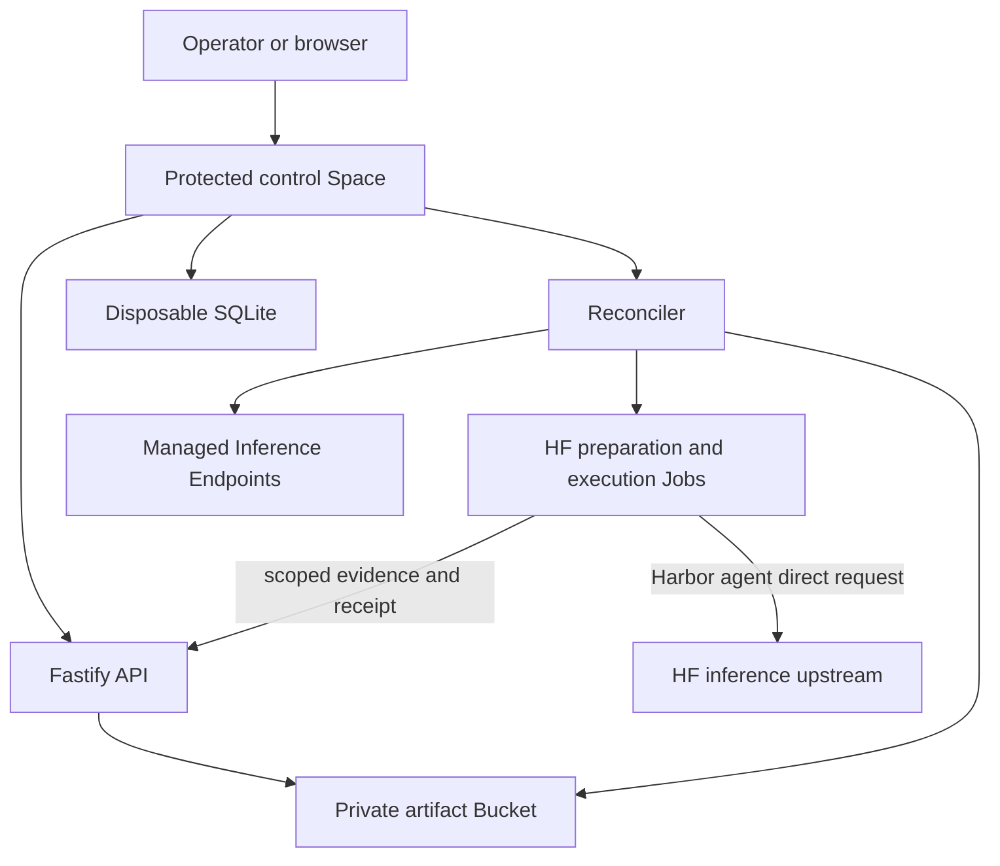

# Architecture

## Purpose

Harbor-HF is the hosted control plane around Harbor.

Harbor owns benchmark resolution, agents, task environments, verification,
trajectories, locks, and native trial results. Harbor-HF owns profile
composition, Run identity, Hugging Face resource lifecycle, durable control
records, physical-attempt policy, evidence retention, cleanup, and publication.

The shared path stays independent of benchmark, model, and harness names.
Normal support for a new value is configuration; a new harness implementation
belongs in a Harbor agent plugin.

## System boundary

The browser never reads the Bucket or receives service credentials. Mutations
write immutable intent before remote side effects. SQLite can be deleted and
rebuilt from Bucket records.

The steady-state inventory is one protected control Space and one private
Bucket. Runs, repairs, profiles, leases, and result subsets do not create their
own persistent stores or services.

## Components

### Control Space

One Node.js process serves the REST API, React application, Server-Sent Events,
and health endpoints while running the background reconciler. The service is
the only shared authority for Run decisions.

`HF_TOKEN` remains in the Space for Bucket and Hugging Face lifecycle
operations. `HF_INFERENCE_TOKEN` is separately scoped and is attached only to
an execution Job whose immutable deployment resolves an inference upstream.

### Immutable artifact Bucket

The Bucket stores:

- profile records and promotions;
- Run requests and locks;
- prepared Harbor jobs and trials;
- action intents, observations, and receipts;
- evidence chunks and manifests;
- logical task selections and retry decisions;
- Endpoint ownership and cleanup observations;
- normalized results and publication receipts; and
- audit and migration records.

Records are versioned, canonical, content-addressed where appropriate, and
append-only. Conflicting bytes at an existing key are an integrity failure.

### Task result persistence

The existing private artifact Bucket stores each finished task result, receipt,
logs, trajectory, usage, cost and provenance. The control service selects a task
only after it reads back the objects and verifies the manifest. A selected task
is durable progress and later Jobs do not run it again.

A physical Job that ends with a replacement-eligible infrastructure failure
leaves the task unresolved. The next execution starts that task again from the
same prepared input. A non-infrastructure terminal outcome is not retried
automatically. Harbor-HF does not save or restore the agent conversation,
workspace, partial provider response, process memory or container state.

Infrastructure executions have no policy retry count. The reconciler can keep
starting the unresolved task while the run remains active, the finite action-key
space has capacity and each launch passes the existing admission and cost
checks. Every failed physical Job and worker generation remains visible in
result provenance. A repeated deterministic failure pauses affected work for a
reviewed worker repair. A normal resume is not a repair. The [task result
persistence and retry plan](2026-09-01-task-result-retry-plan.md) defines the
implementation and remote checks.

### Profile resolver

The model profile supplies the canonical Harbor model route and supported
inference APIs. The harness profile supplies a model-independent
`AgentConfig` template, exact agent revision, capabilities, and evidence
requirements. The deployment supplies the worker image, HF route, upstream
URL, API, prices, limits, hardware, and timeouts.

For direct inference, the resolver:

1. validates the `openai/<model>:<provider>` Harbor route;
2. checks that the provider suffix matches the deployment;
3. checks model and harness support for the declared API;
4. sets `OPENAI_BASE_URL` to the exact upstream;
5. references `HF_INFERENCE_TOKEN` as `OPENAI_API_KEY`;
6. locks timeout and output-token settings; and
7. adds the upstream hostname to Harbor's allowed hosts.

There is no alternate model binding or API translation in the worker.

Approved immutable profiles that pin a historical bridge worker retain a
conditional bootstrap and provider-capacity reservation path. Direct profiles,
including the Fast-Agent Workbench deployment, do not use that compatibility
path.

### Preparation Job

The preparation Job has no persistent secret. It installs pinned Harbor and
agent-package revisions, builds a normal Harbor `JobConfig`, and uses Harbor's
public planning API to resolve the benchmark.

It returns one immutable prepared record per logical trial and a final prepared
job record. Those records bind Harbor locks, task and image digests, resources,
timeouts, agent configuration, source revisions, and worker provenance.

Preparation is the only point at which the benchmark is resolved. Execution,
retry, and recovery reconstruct the exact prepared trial.

### Execution Job

Each physical attempt runs in one HF Job using the reviewed trial-worker image,
never the task image as the host image. The worker verifies and unpacks the
locked task image and runs the task as a dedicated unprivileged host UID.

The Job receives:

- one task assignment;
- a short-lived capability scoped to its Run and launch action;
- the exact prepared trial and execution contract; and
- `HF_INFERENCE_TOKEN` only when direct inference is required.

Harbor loads the selected agent through `AgentConfig.import_path`. The agent
receives the profile-resolved upstream, credential, model, API, timeout, and
output limit and calls the HF inference upstream directly. After the agent and
its descendants stop, the worker freezes the workspace and Harbor runs the
verifier against that state.

The worker rejects lock drift, evidence mismatch, leaked credentials, or
invalid task-image boundaries before posting a terminal receipt.

### Managed Endpoint route

Endpoint-backed deployments remain separate from direct calls to HF inference
services. Their immutable deployment contract covers model and engine
revision, image, command, hardware, replica policy, parsing and template
settings, context and batching limits, and health checks.

The reconciler adopts or creates only the deterministic Endpoint, verifies its
effective configuration, and records ownership. Cleanup has priority over new
work. A Run cannot complete until every owned Endpoint is observed paused with
zero ready replicas.

### Reconciler

The reconciler rebuilds state from immutable records and selects one
deterministic next action. The action sequence separates intent, admission,
dispatch, observation, receipt, and advancement.

An ambiguous HF response does not authorize another create call. The
reconciler observes the deterministic remote identity and either adopts it or
records a typed failure. Cancellation stops new admission while preserving
active evidence finalization and cleanup.

### Evidence and publication

Workers upload content-addressed chunks and a canonical manifest through their
scoped capability. The control service verifies every digest, reference,
required media type, Run and task identity, and secret-scan result.

Canonical evidence includes the Harbor lock and result, workspace archive and
index, native session or ATIF trajectory when required, verifier output,
worker logs, source and image provenance, and infrastructure receipts. Evidence
requirements come from the harness and benchmark contracts.

Publication is a later deterministic action over accepted canonical evidence.
It emits normalized result objects and approved public views. Workers never
write directly to shared public destinations.

## Identity and reproducibility

A Run locks:

- exact profile record IDs and digests;
- benchmark source and task digests;
- Harbor and agent-package revisions;
- task and worker image digests;
- model route and observable revision;
- inference provider, upstream, and API;
- agent entry point, revision, and parameters;
- hardware, resources, phase limits, and prices;
- attempt, admission, and spend policy; and
- evidence and publication policy.

Aliases are submission conveniences only. A behavior-affecting change creates a
new immutable profile and, for executed work, a new Run identity.

1. An experiment groups a requested matrix.
2. A run represents one homogeneous matrix cell.
3. A trial represents one task and logical benchmark attempt.
4. An execution represents one physical Job invocation. An unresolved trial can
   have more than one infrastructure execution.

An infrastructure retry starts the prepared task again and stays under the same
trial. It does not consume another benchmark attempt. Failed executions remain
immutable records. Replacement benchmark attempts remain separate trials and
never replace previous records. Composite or manually selected results must be
labeled explicitly and must not appear as single-run results.

Failures are typed as infrastructure or semantic outcomes.

Replacement-eligible infrastructure examples include a transient HF Job
failure, control unavailability, image transfer failure, or malformed
infrastructure receipt. Deterministic worker defects stop affected work.

Semantic outcomes include model refusals, valid zero scores, benchmark
timeouts, agent failures, and verifier failures. They are not rerun as
infrastructure.

A replacement physical attempt keeps the same prepared trial and logical task
identity. Any change to model, agent, source, image, API, limits, hardware, or
policy requires a linked replacement Run. Publication recovery does not call
the model again.

## Security boundaries

- The control credential never enters a Job.
- Preparation Jobs receive no inference credential.
- Direct-inference agents are reviewed secret consumers.
- Jobs have no writable canonical Bucket mount.
- Worker capabilities are short-lived and operation-scoped.
- Task execution uses a dedicated unprivileged host UID with no supplementary
  groups, capabilities, or privilege escalation.
- Credential values and high-confidence patterns are scanned in paths, files,
  logs, sessions, traces, manifests, and publication candidates.
- Public responses omit private topology, raw evidence, credentials, and
  capabilities.

Direct inference intentionally gives the selected agent access to the
inference credential. Arbitrary user code must therefore remain setup-only
until a separate user-secret custody design is approved.

## Boundaries

Harbor-HF does not:

- modify Harbor core or monkeypatch Harbor internals;
- add benchmark-, model-, or harness-specific branches to the control path;
- run models or benchmark tasks on the operator machine as part of the hosted
  control path;
- translate between Chat Completions and Responses;
- treat local SQLite as durable truth;
- expose the private Bucket to browsers;
- hide infrastructure failure inside a model score; or
- rewrite historical evidence.

See [the control-service specification](CONTROL_SERVICE.md) and
[the Harbor compatibility contract](harbor-integration-contract.md).
