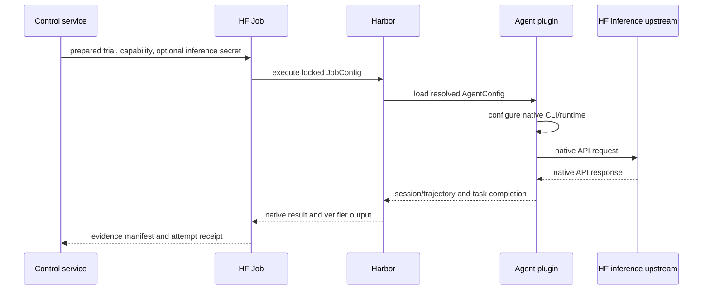

# Harbor agent architecture

## Decision

Inference-backed harnesses run as Harbor agent plugins and connect directly to
the profile-approved Hugging Face inference upstream. Harbor loads each plugin
through `AgentConfig.import_path`; Harbor-HF does not modify Harbor core or add
another inference service inside the Job.

The design has three goals:

1. keep Harbor-HF core independent of harness names;
2. preserve each tool's native supported inference API; and
3. make the immutable Harbor configuration the only source of model and route
   selection.

## Ownership

### `harbor-hf-agents`

The Python package owns:

- one Harbor agent module per supported harness;
- isolated unprivileged command execution;
- native tool installation at an exact revision;
- conversion of `AgentConfig.env` into tool-specific settings;
- cleanup of agent descendants before verification;
- native session capture and redaction;
- ATIF conversion where needed; and
- typed setup and runtime failures.

Shared support code remains harness-neutral:

```text
packages/harbor-hf-agents/src/harbor_hf_agents/
  <agent>/
    agent.py
  support/
    direct_inference.py
    isolated_user.py
    control_job_environment.py
    control_prepare_worker.py
    control_trial_job_worker.py
```

### Harbor-HF control

The TypeScript service owns:

- immutable model, harness, deployment, and launch-policy profiles;
- compatibility validation and execution-contract composition;
- preparation and execution Job lifecycle;
- capability issuance;
- evidence acceptance;
- retry and completion policy; and
- result publication.

It treats agent names as data. Adding a normal agent does not add a core API
route, schema branch, worker branch, or deployment action type.

### Harbor

Harbor owns agent loading, task-environment interaction, verifier execution,
locks, results, and native trajectory semantics. Plugins use only Harbor's
public interfaces.

## Run-native execution contract

The model profile supplies a canonical route:

```text
openai/<model-id>:<inference-provider>
```

The harness profile supplies:

- `import_path`;
- exact tool revision;
- permitted keyword arguments;
- supported APIs;
- required evidence; and
- session and trajectory policy.

The deployment supplies:

- the HF inference upstream;
- `chat-completions` or `responses`;
- timeout and output-token limits;
- immutable prices;
- worker image and command;
- hardware and task-image limits; and
- the supported model and harness profile names.

Composition verifies the model route and API, then writes the final
`AgentConfig`:

```json
{
  "import_path": "harbor_hf_agents.<agent>.agent:<AgentClass>",
  "model_name": "openai/<model-id>:<inference-provider>",
  "env": {
    "OPENAI_API_KEY": "${HF_INFERENCE_TOKEN}",
    "OPENAI_BASE_URL": "https://router.huggingface.co/v1",
    "HARBOR_HF_OUTPUT_LIMIT": "32768",
    "HARBOR_HF_PROVIDER_TIMEOUT_SECONDS": "1800"
  },
  "extra_allowed_hosts": ["router.huggingface.co"]
}
```

The concrete values above are illustrative; profiles provide the locked
values.

## Direct inference flow



The plugin:

1. validates that the model name contains Harbor's provider prefix;
2. derives only the provider-facing part after that prefix;
3. reads the upstream and credential from `AgentConfig.env`;
4. validates the positive output-token setting when present;
5. adds only documented tool-specific aliases;
6. starts the pinned native runtime as the dedicated agent user; and
7. quiesces the task environment before Harbor verifies it.

The plugin cannot choose a different provider, API, model, or host.

## API preservation

API compatibility is fail-closed:

- Chat Completions agents use deployments declaring `chat-completions`.
- Responses agents use deployments declaring `responses`.
- A model route must advertise the same API.
- The deployment provider must match the model-route suffix.

Do not rewrite payloads to make an incompatible tool appear supported.
Unsupported matrix cells are skipped without creating a Run and without being
counted as benchmark failures.

## Credential handling

The control Space holds two persistent credentials:

- `HF_TOKEN`, used only by the control service; and
- `HF_INFERENCE_TOKEN`, used for inference-backed execution.

Preparation and no-inference Jobs do not receive the inference credential.
An eligible execution Job receives it as an encrypted Job secret. Harbor
expands `${HF_INFERENCE_TOKEN}` from the resolved `AgentConfig.env`, and the
plugin supplies it to the native agent runtime.

This is an explicit trust decision: the reviewed agent and its descendants are
credential consumers. Arbitrary customer-authored code cannot use this launch
path. Workbench recipes remain setup-only unless their exact compiled form is
promoted as a reviewed harness profile.

The worker still receives a separate short-lived control capability. That
capability is limited to the Run, launch action, assigned task, evidence
operations, and expiration. Jobs never receive the control credential or a
writable canonical Bucket mount.

## Isolation

The trial worker verifies and unpacks the locked task image into a root-owned
workspace. It launches task and agent commands as a dedicated real host UID
with:

- no supplementary groups;
- an empty capability set;
- `no_new_privs`;
- no writable worker files;
- no writable canonical Bucket mount; and
- no control-service credential.

PRoot presents the task filesystem but is not considered a security boundary.
The agent and task share the task environment by design. Agent descendants are
stopped before workspace freeze and verifier execution.

## Agent requirements

Every agent module must:

- use an exact package version or full Git commit;
- reject missing or malformed model and environment settings;
- preserve the resolved upstream and API;
- avoid global mutable state between trials;
- run commands through the common isolated-user helpers;
- stop descendants before verification;
- preserve the native session when required;
- redact known credentials before evidence acceptance;
- emit or convert to valid ATIF when required; and
- map failures into the shared taxonomy.

Installation environment values are explicit plugin data and apply only during
installation. Runtime inference settings apply only while the agent runs and
are restored afterward.

## Evidence

Agent evidence may include:

- exact plugin and native tool revisions;
- sanitized generated configuration;
- native session;
- ATIF trajectory;
- stdout and stderr;
- timing and exit status;
- frozen workspace;
- Harbor result and verifier output; and
- source, image, and worker provenance.

Do not store authorization headers, API keys, cookies, signed capabilities,
prompts or responses copied solely for transport auditing, or private route
details.

Known secret values and high-confidence credential patterns are scanned in
filenames and file bytes. A finding invalidates the physical attempt; canonical
evidence is not rewritten to disguise a leak.

## Failure policy

Agent setup, invalid native configuration, unsupported API behavior, and
malformed required sessions are agent outcomes unless evidence shows an
external infrastructure fault.

Transient Job lifecycle, task-image transfer, control availability, or HF
service failures may be replacement-eligible infrastructure. A deterministic
defect shared by the worker or plugin stops affected work.

Model refusals, tool behavior, benchmark timeouts, and verifier outcomes remain
semantic. They are not replaced as infrastructure.

## Adding an agent

1. Confirm that the native tool supports one existing declared API.
2. Add a module behind Harbor's public agent interface.
3. Reuse neutral direct-inference and isolated-user helpers.
4. Pin the native revision.
5. Define strict arguments, session, trajectory, and failure behavior.
6. Add an immutable harness profile.
7. Add compatible deployment-profile references without core name branches.
8. Run local contract, isolation, redaction, and failure tests.
9. Run only separately authorized remote canaries.

If another compatible model can use the same implementation unchanged, the
boundary is probably correct. If core logic must inspect the agent name, move
the behavior into the plugin or represent it as a general capability.

## Verification matrix

Local validation covers:

- import-path and exact-revision enforcement;
- direct environment resolution and cleanup;
- API and provider-suffix mismatch rejection;
- upstream host allowlisting;
- missing credential and malformed output-limit rejection;
- installation-environment scoping;
- real-UID execution and descendant cleanup;
- model and agent identity drift;
- native session selection and redaction;
- ATIF conversion, including parallel tools and Unicode;
- planted secrets in paths, sessions, trajectories, logs, and workspaces;
- failure categorization; and
- deterministic behavior on successful and failed installation or execution.

Remote verification, when approved, retains Harbor results, required sessions
or trajectories, workspace and verifier evidence, provenance, checksums, and
secret-scan results.
